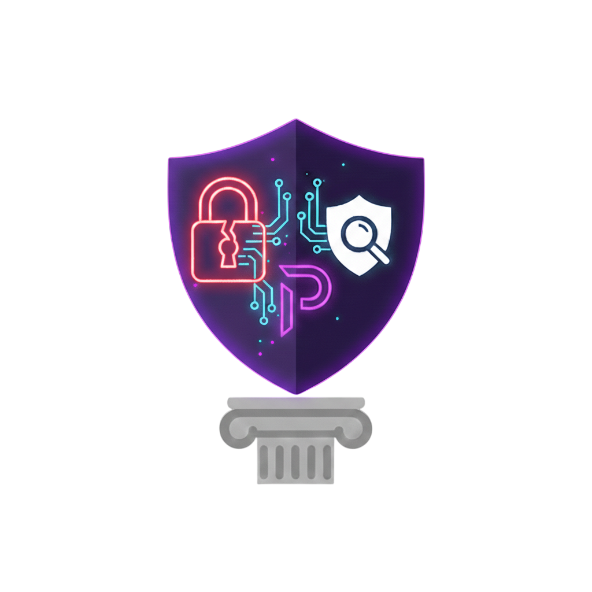

# 🏛️ Stoicus Cyber | Purple Team Lab & Research

> **"Analizando el ataque para fortalecer la infraestructura."**  
> Espacio dedicado a la documentación técnica sobre Seguridad Ofensiva, Respuesta ante Incidentes y Administración de Sistemas (ASIR).

---

## 🔍 Bitácora de Investigación

Este repositorio contiene el código fuente y los activos de mi blog profesional. Aquí documento mi metodología de trabajo, combinando la mentalidad analítica del **Blue Team** con la ejecución táctica del **Red Team**.

👉 **[Explorar Stoicus Cyber](https://zilr4c.github.io/)** 🏛️

---

## 🚀 Áreas de Enfoque Técnico

### 🔵 Defensive Operations (Blue Team)

* **Threat Hunting & SIEM:** Monitorización avanzada de eventos y análisis de logs (Splunk/ELK).
* **Hardening:** Aseguramiento de infraestructuras críticas Linux y Windows.
* **DFIR:** Metodologías de triage y respuesta ante incidentes basadas en el framework de **BTL1**.

### 🔴 Offensive Operations (Red Team)

* **Pentesting:** Compromiso de sistemas y escalada de privilegios bajo estándares de **OSCP+**.
* **Active Directory:** Explotación de vectores de ataque en entornos de dominio.
* **Web Security:** Pentesting web avanzado, análisis de vulnerabilidades complejas y evasión de controles basado en **eWPTXv3**.

### 🤖 Automation & Scripting

* **Security Tooling:** Desarrollo de herramientas en **Bash y Python** para optimizar la enumeración (ej. `autonmap`).
* **Data Driven Security:** Aplicación de consultas **SQL** para el análisis de grandes volúmenes de datos operativos.

---

## 🛠️ Tecnologías & Herramientas

---

## 📂 Estructura del Proyecto

El blog está construido con **Jekyll** utilizando el tema **Chirpy**, optimizado para documentación técnica limpia.

* `_posts/` - Artículos técnicos, writeups de máquinas y guías de hardening.
* `assets/img/posts/` - Diagramas de red, evidencias de explotación y flujos de trabajo.

---

<a href="https://www.linkedin.com/in/humberto-boscan"><b>LinkedIn</b></a>
•
<a href="https://zilr4c.github.io/about/"><b>Sobre mí</b></a>

