Bienvenidos al desenlace de nuestra trilogía sobre seguridad en Kerberos.

Si has estado siguiendo la serie, ya tienes el escenario completo: En la [Parte 1]() levantamos nuestra infraestructura de Windows Server (y, estratégicamente, dejamos las defensas bajas). En la [Parte 2](), nos pusimos el "**sombrero negro**" y utilizamos Kali Linux para demostrar lo vulnerables que pueden ser las cuentas mal configuradas frente a ataques de **AS-REP Roasting** y **Kerberoasting**.

Pero hoy, la historia cambia. Es momento de dejar de ser la presa y convertirnos en el cazador.

En esta tercera y última entrega, nos enfocamos en la **Defensa y Detección**. Vamos a construir nuestro propio Centro de Operaciones de Seguridad (SOC) a pequeña escala. Aprenderemos que los ataques que ejecutamos anteriormente no son invisibles; dejan un rastro de "migas de pan" digitales en los logs de eventos que, con la configuración adecuada, se convierten en alertas críticas.

**En este cierre de laboratorio aprenderás a:**

* **Desplegar y asegurar un entorno Linux:** Prepararemos **Ubuntu Server** desde la base, optimizando el acceso remoto y el firewall para actuar como el núcleo de nuestro SIEM.
* **Orquestar Splunk de extremo a extremo:** Configuraremos el **Indexer** en Linux y el **Universal Forwarder** en Windows, asegurando que la comunicación y la ingesta de datos sean fluidas y precisas.
* **Dominar la Telemetría y GPOs:** Ajustaremos políticas de grupo y archivos de configuración avanzada (`props.conf` e `inputs.conf`) para capturar la evidencia exacta que Kerberos genera bajo ataque.
* **Realizar Análisis Forense Retrospectivo:** Interrogaremos los logs históricos para identificar las huellas de los ataques realizados en la **Parte 2** (AS-REP Roasting y Kerberoasting).
* **Construir un SOC Operativo:** Diseñaremos alertas automáticas y un **Dashboard visual (Centro de Mando)** para transformar miles de eventos en inteligencia táctica en tiempo real.
* **Validar Defensas (Red vs. Blue):** Ejecutaremos una simulación en vivo para comprobar cómo nuestro SIEM detecta y visualiza la actividad del atacante de forma inmediata.
* **Aplicar Estrategias de Hardening:** Identificaremos las recomendaciones críticas de mitigación (como el uso de **gMSA** y cifrado **AES**) para cerrar las brechas de seguridad definitivamente.

> **Nota de contexto:** Este post es el puente entre la vulnerabilidad y la resiliencia. Si te perdiste los pasos previos de configuración de sistema vulnerable o ataque, te recomiendo echarles un vistazo para entender el origen de los datos que vamos a procesar hoy.
{: .prompt-info }


## Fase 1: Despliegue de la Infraestructura (Ubuntu SIEM)
En esta primera etapa, prepararemos el "cerebro" de nuestro laboratorio: un servidor Ubuntu que albergará nuestro SIEM (**Splunk**). El objetivo es crear un entorno controlado, aislado y con una dirección fija para la recepción de eventos.

### 1. Descarga de Ubuntu Server
Comenzamos descargando la imagen ISO de la versión estable más reciente.
- Enlace oficial: [Ubuntu Server](https://ubuntu.com/download/server)

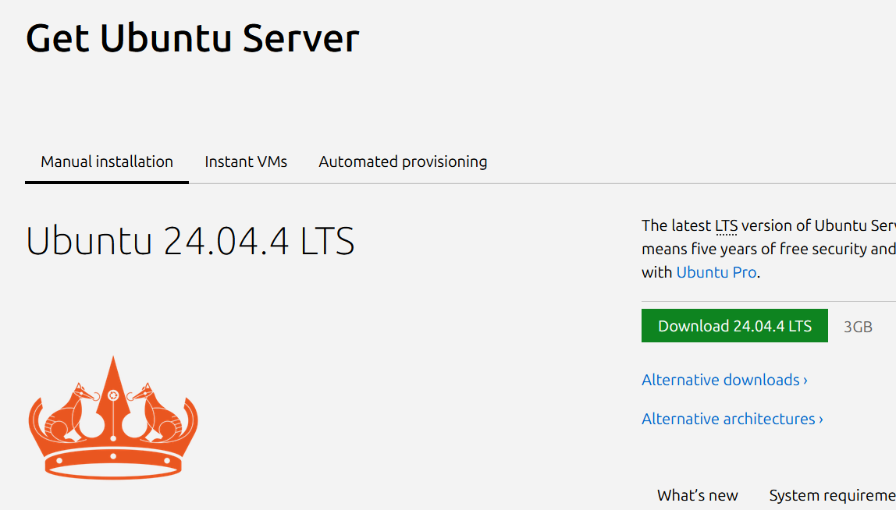{: width="500" }
    
### 2. Configuración de la Máquina virtual (Vmware)

Al crear la VM, omitiremos los pasos genéricos del asistente y nos centraremos en la asignación de recursos y el aislamiento de red, que son las piezas críticas para nuestro laboratorio.

- **Imagen de Sistema:** Selecciona la ISO de Ubuntu Server previamente descargada.

- **Hardware y Red (Importante):** En la personalización del hardware, ajustamos los siguientes parámetros:

  - **Memoria RAM:** 8 GB (mínimo recomendado). Splunk es intensivo en memoria debido a sus procesos de indexación y búsqueda; menos de esto causará lentitud extrema.

  - **Adaptador de Red (NAT):** Crea una red privada para tus máquinas virtuales. Esto las mantiene invisibles para el resto de dispositivos de tu casa (como otros móviles o PCs), evitando "ruido" externo. Al mismo tiempo, permite que tu ordenador real y las máquinas del laboratorio se comuniquen entre sí y tengan salida a Internet para descargar herramientas.

### 3. Instalación Ubuntu Server
Durante el proceso de instalación, seguiremos los pasos estándar, prestando especial atención a lo siguiente:

- **Profile configuration:** Se añade nombre, usuario contraseña.

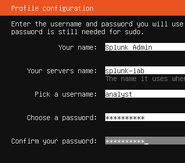{: width="400" }
  
- **SSH Configuration:** Marcamos el checkbox de `Install OpenSSH Server`.

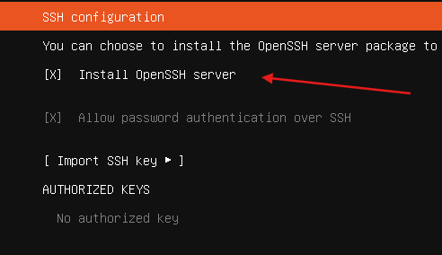{: width="400" }

- **Finalización:** Una vez instalado, selecciona `Reboot Now`. Recuerda retirar la ISO virtual si el sistema te lo solicita para evitar entrar de nuevo al instalador.

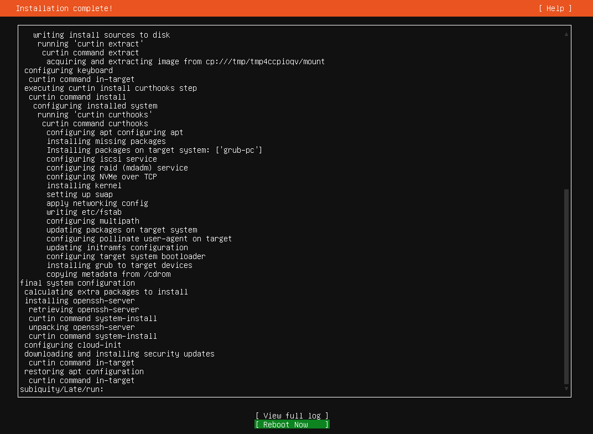{: width="400" }

### 4. Primer Inicio y Optimización
Tras el reinicio, iniciamos sesión localmente para realizar ajustes de comodidad:

```bash
# Instalación de herramientas de red básicas
sudo apt update && sudo apt install net-tools -y

# Configuración del teclado al español (si es necesario)
sudo loadkeys es
```

### 5. Acceso Remoto: Simulando el Terminal del Analista
Un analista de ciberseguridad rara vez trabaja directamente en la consola física del servidor. Utilizaremos SSH desde nuestra máquina de gestión (en este caso, un Windows Server o tu PC anfitrión) para ganar flexibilidad: copiar/pegar comandos, múltiples pestañas y gestión de archivos.


- Identifica la IP asignada por DHCP: `ifconfig` o `ip a`.

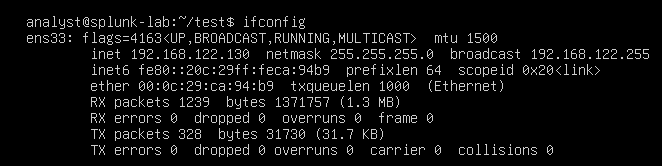

- Conéctate desde tu terminal favorito:

```bash
ssh analyst@192.168.122.130
```

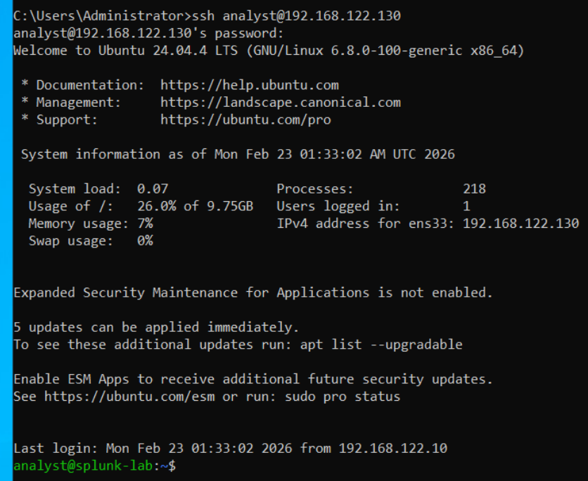{: width="500" }

### 6. Configuración de IP Estática
Para que nuestro SIEM sea confiable, no puede cambiar de dirección IP cada vez que se reinicie. Configuraremos una IP fija mediante **Netplan**.

```bash
# Editamos el archivo de configuración
sudo nano /etc/netplan/00-installer-config.yaml

# Configuración recomendada:
network:
  version: 2
  renderer: networkd
  ethernets:
    ens33:                  # Cambia esto por el nombre de tu interfaz
      dhcp4: no
      addresses:
        - 192.168.122.11/24   # La IP que quieras para tu Splunk
      routes:
        - to: default
          via: 192.168.1.1  # La IP de tu router o Gateway
      nameservers:
        addresses: [8.8.8.8, 1.1.1.1]

```
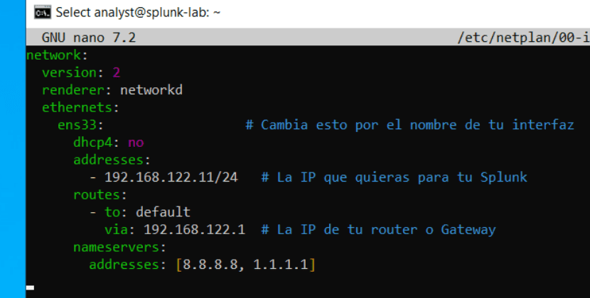{: width="500" }

**Aplicar cambios:**

```bash
# Ajustamos permisos de seguridad
sudo chmod 600 /etc/netplan/00-installer-config.yaml

# Aplicamos la nueva configuración
sudo netplan apply
```

**Verificando IP:**
Tras aplicar los ajustes, verificamos que la configuración se ha implementado correctamente, quedando asignada la dirección IP estática `192.168.122.11`

```bash
ifconfig 
```

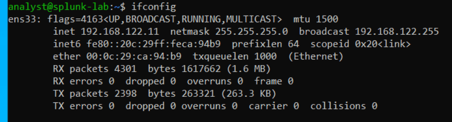

> **Por qué es clave:** "En un entorno real, el SIEM debe tener una dirección fija para que todos los agentes (Forwarders) sepan siempre a dónde enviar los logs".
{: .prompt-info }


### 7. Fortalecimiento del Host: Firewall
Siguiendo el Principio de Mínimo Privilegio, cerraremos todas las conexiones excepto las estrictamente necesarias para el funcionamiento del laboratorio.

```bash
# Configuración por defecto: denegar todo lo entrante, permitir lo saliente
sudo ufw default deny incoming
sudo ufw default allow outgoing

# Apertura de puertos específicos
sudo ufw allow 22/tcp
sudo ufw allow 8000/tcp
sudo ufw allow 9997/tcp

# Activación del Firewall
sudo ufw enable
```

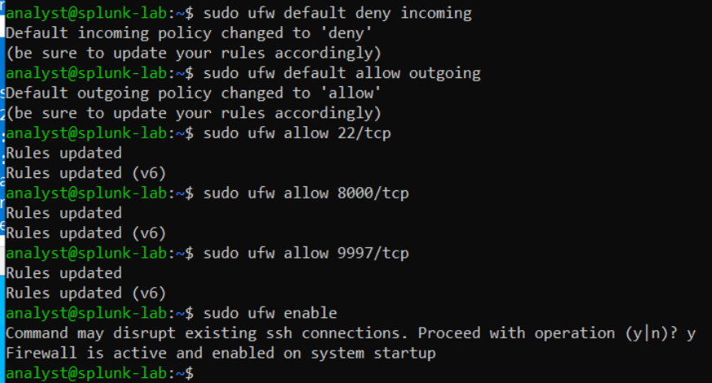{: width="500" }

> **¿Por qué es clave?** En un entorno real, el SIEM es un objetivo primario para los atacantes. Limitar los puertos abiertos reduce la superficie de ataque del servidor que precisamente debe protegernos.
{: .prompt-tip }

**Verificando estado de firewall:**

```bash
sudo ufw status verbose
```

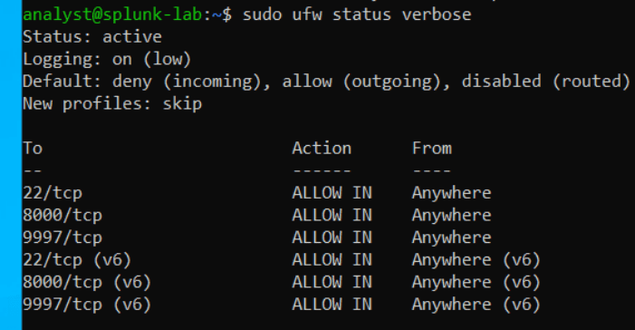{: width="500" }

## Fase 2: Splunk

En esta fase configuraremos el ecosistema de logs.
### 1. Descarga de splunk
Para este laboratorio, utilizaremos las versiones de prueba de Splunk. Necesitarás una cuenta gratuita en [splunk](https://www.splunk.com/).

- **Splunk Enterprise  10.2.0 (para Ubuntu):** Actuará como nuestro servidor central.

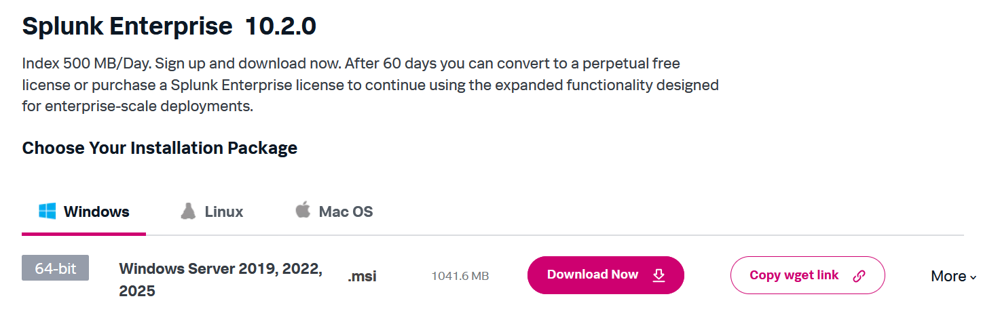{: width="500" }

- **Splunk Universal Forwarder  10.2.0 (para Windows):** El agente ligero que enviará los eventos al servidor.

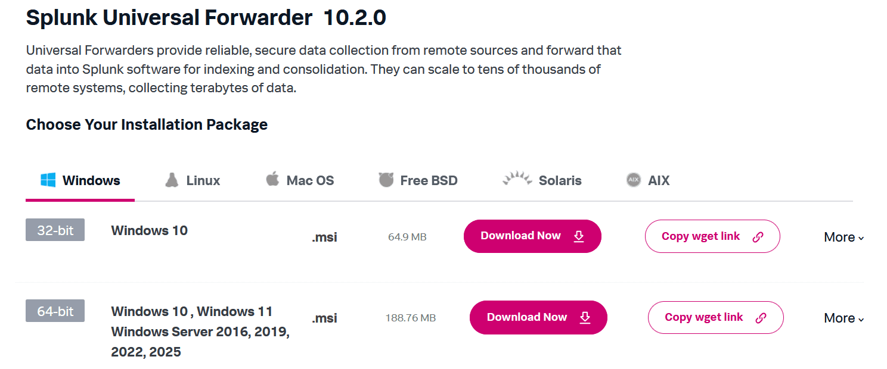{: width="500" }

> **Tip:** Puedes copiar el enlace de descarga de la web de Splunk y usar wget directamente en la terminal de Ubuntu para ahorrar tiempo.
{: .prompt-tip }

### 2. Configuración del Indexer (Ubuntu Server)
#### 1. Transferencia e Instalación
Si descargaste el archivo `.deb` en tu máquina de analista, envíalo al servidor mediante `scp`:

```bash
# Desde tu máquina local
scp splunk-10.x.x-amd64.deb analyst@192.168.122.11:/home/analyst/
```

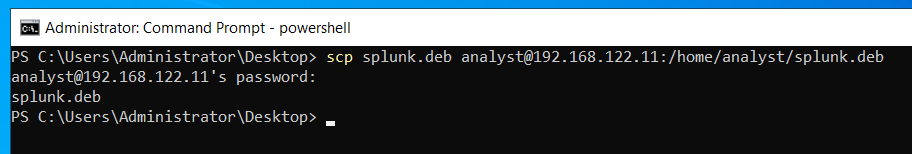

Una vez en el servidor, procedemos con la instalación.

```bash
# Instalación del paquete
sudo dpkg -i splunk.deb
```

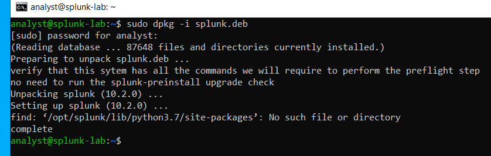

#### 2. Ejecutando splunk
Una vez instalado, procederemos a iniciar el servicio de Splunk por primera vez. Durante este proceso, el asistente nos solicitará configurar las credenciales de administrador para acceder a la consola web.

```bash
sudo /opt/splunk/bin/splunk start --accept-license --run-as-root
```

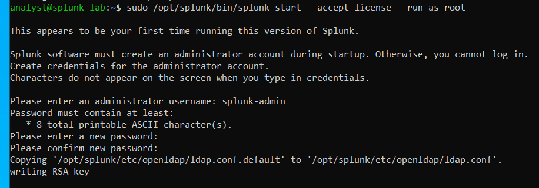

> **Importante:** Al ejecutarlo, el sistema te pedirá definir un nombre de usuario (por defecto suele usarse admin) y una contraseña segura. No olvides estos datos, ya que son los que usarás en el navegador.
{: .prompt-warning }

Tras completar la configuración inicial, la terminal confirmará que el servidor está arriba y nos indicará la URL de acceso, que por defecto utiliza el puerto 8000.

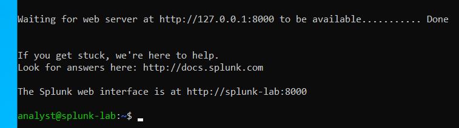


#### 3. Iniciando sesión en splunk
Ahora se puede acceder desde el navegador de la máquina del analista:
  - **URL:** `http://192.168.122.11:8000`
  - **Credenciales:** Las que definiste en el paso anterior.

<div class="row justify-content-center align-items-center">
  <div class="col-md-5 text-center">
    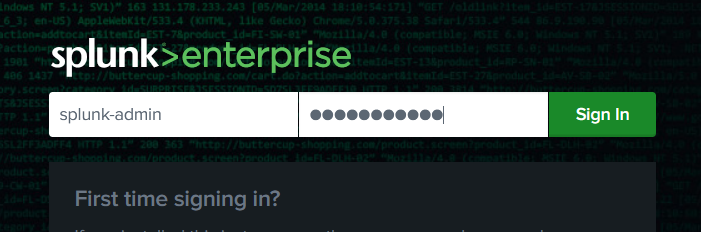
  </div>
  <div class="col-md-5 text-center">
    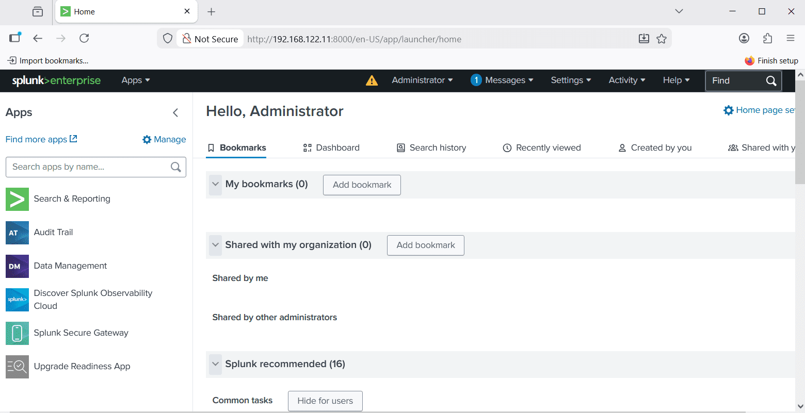
  </div>
</div>


### 3. Configuración Windows Server - Splunk
Para que Splunk pueda leer los logs de Seguridad de Active Directory de forma segura, no usaremos la cuenta de "Sistema". Aplicaremos el **Principio de Mínimo Privilegio** creando una cuenta de servicio dedicada.

#### 1. Crear cuenta de servicio `svc_splunk`
Ejecuta esto en PowerShell como Administrador:

```powershell
# 1. Crear la cuenta de servicio (te pedirá la contraseña interactivamente)
$pwd = Read-Host -AsSecureString "Introduce la contraseña para svc-splunk"
New-ADUser -Name "svc_splunk" `
           -SamAccountName "svc_splunk" `
           -UserPrincipalName "svc_splunk@stoicus.lab" `
           -Description "Cuenta de servicio para Splunk Universal Forwarder" `
           -Enabled $true `
           -ChangePasswordAtLogon $false `
           -AccountPassword $pwd

# 2. Añadir la cuenta al grupo 'Event Log Readers' para que pueda leer logs de seguridad
Add-ADGroupMember -Identity "Event Log Readers" -Members "svc_splunk"
```

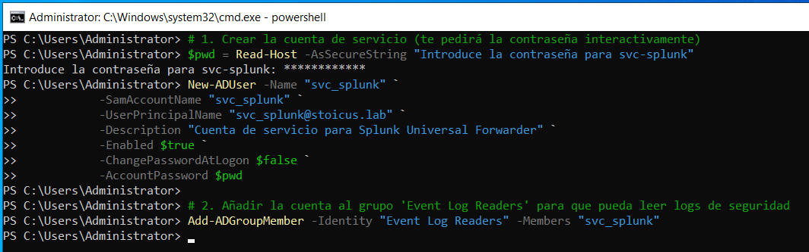

#### 2. Configuración de la GPO (Log on as a Service)
Esto es vital. Si no lo haces, el servicio de Splunk no podrá arrancar aunque la contraseña sea correcta.

-  Se abre Group Policy Management (`gpmc.msc`).

-  Se Crea una nueva GPO llamada "`Splunk_UF_Policy`" 

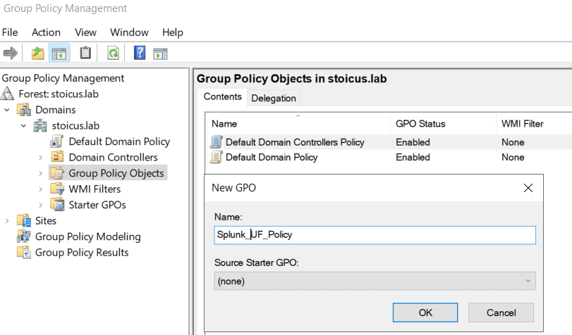{: width="500" }

-  Edíta la GPO creada y navega en la nueva pestaña a la siguiente ruta:
`Computer Configuration > Policies > Windows Settings > Security Settings > Local Policies > User Rights Assignment`.

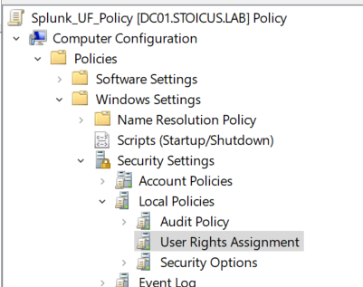

-  Localiza la directiva: `Log on as a service` (Iniciar sesión como servicio).
-  Haz doble clic y añade a la cuenta de servicio: `STOICUS\svc_splunk`.

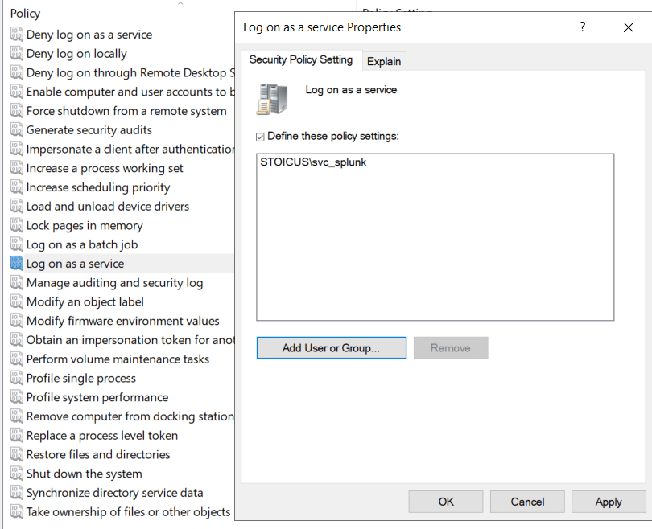{: width="500" }

- Haz clic en Apply y OK para guardar los cambios.

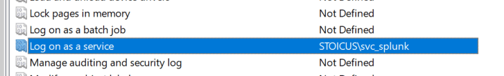{: width="500" }

- Vincular GPO al dominio (Powershell)

```powershell
# Vincula la GPO al nivel raíz del dominio
New-GPLink -Name "Splunk_UF_Policy" -Target "dc=stoicus,dc=lab"
```
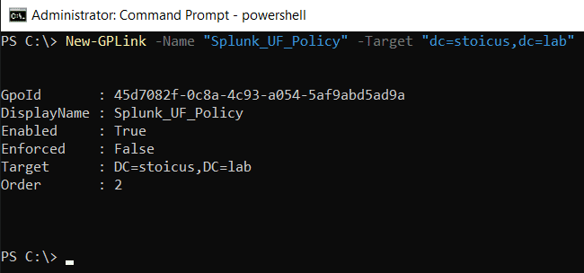{: width="600" }

#### 3. Instalación Splunk Universal Forwarder 
El proceso de instalación en el Domain Controller debe hacerse con cuidado. No utilizaremos la configuración por defecto, ya que necesitamos que el servicio corra bajo la cuenta que creamos anteriormente (`svc_splunk`).

**Paso 1: Inicio y Personalización**

- Haz clic en `Customize Options`.
- Acepta la licencia y pulsa Next.

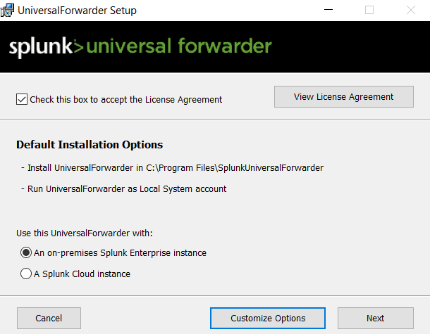{: width="400" }

**Paso 2: Configuración de la Cuenta de Servicio**

- Selecciona la opción `Domain Account`. Esto permitirá que Splunk use los privilegios de Directorio Activo que configuramos en la GPO.

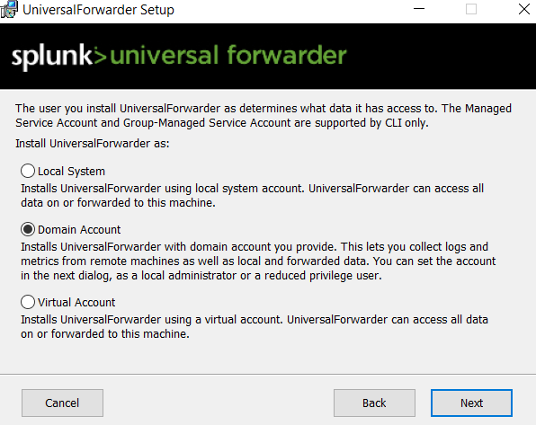{: width="400" }

- Introduce las credenciales de la cuenta `svc_splunk` (**formato:** `STOICUS\svc_splunk`).

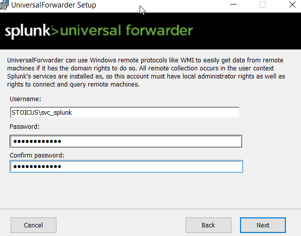{: width="400" }

**Paso 3: Asignación de Privilegios**
El instalador detectará los privilegios necesarios. Asegúrate de que estén marcados:

- **SeBackupPrivilege:** Para leer archivos de registro.
- **SeSecurityPrivilege:** Para acceder al log de Seguridad.
- **SeImpersonatePrivilege:** Para que el servicio pueda actuar en nombre del sistema al recolectar datos.

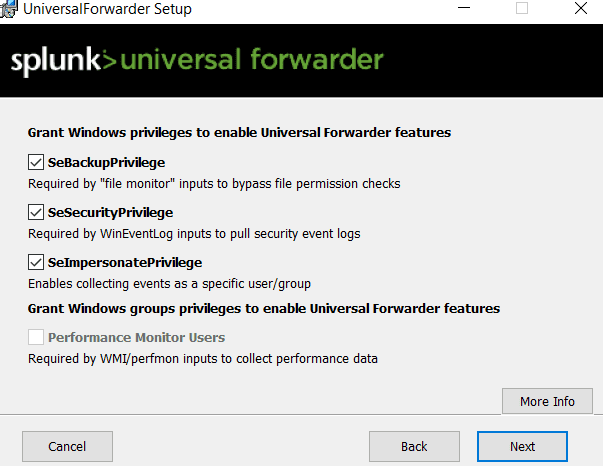{: width="400" }

**Paso 4: Selección de Eventos (Data Collection)**
Filtramos la telemetría para centrarnos en lo que importa:
- **Marcamos:** Application, System y, sobre todo, Security (donde vive Kerberos).
- **Desmarcamos:** Performance Monitor (no es relevante para este análisis de seguridad).

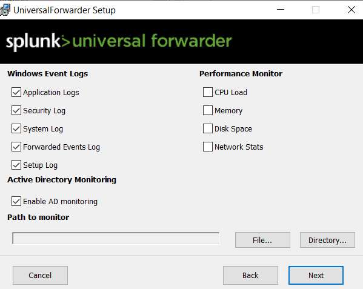{: width="400" }

**Paso 5: Credenciales del Administrador de Splunk (Local)**
Crea un usuario administrador para la gestión local del Forwarder.

> **Nota:** Este usuario es independiente de la cuenta de servicio de Windows; sirve para gestionar el agente desde la línea de comandos si fuera necesario
{: .prompt-info }

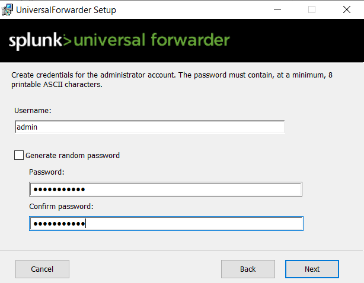{: width="400" }

**Paso 6: Configuración del Receiving Indexer**
Apuntamos el tráfico hacia nuestro cerebro en Ubuntu:
  - **IP del Servidor Splunk:** `192.168.122.11`
  - **Puerto:** 9997 (Puerto de ingesta por defecto).

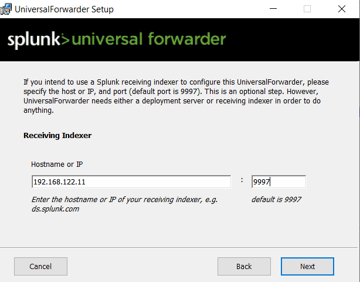{: width="400" }

**Paso 7: Finalización**
Tras unos segundos, verás el mensaje de confirmación. El servicio debería estar corriendo y enviando datos de inmediato.

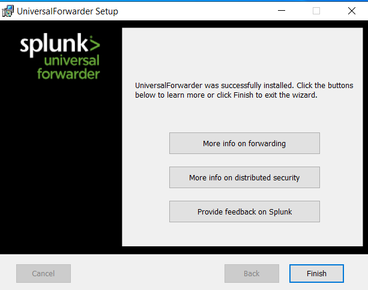{: width="400" }

### 4. Habilitar la recepción en el Servidor Splunk
Aunque el agente ya está instalado, el servidor aún no está escuchando. Debemos abrir la "puerta" (puerto 9997) en la interfaz de Splunk.

- Entra a la interfaz web: http://192.168.122.11:8000

- Ve a **Settings** (Configuración) > **Forwarding and receiving**.

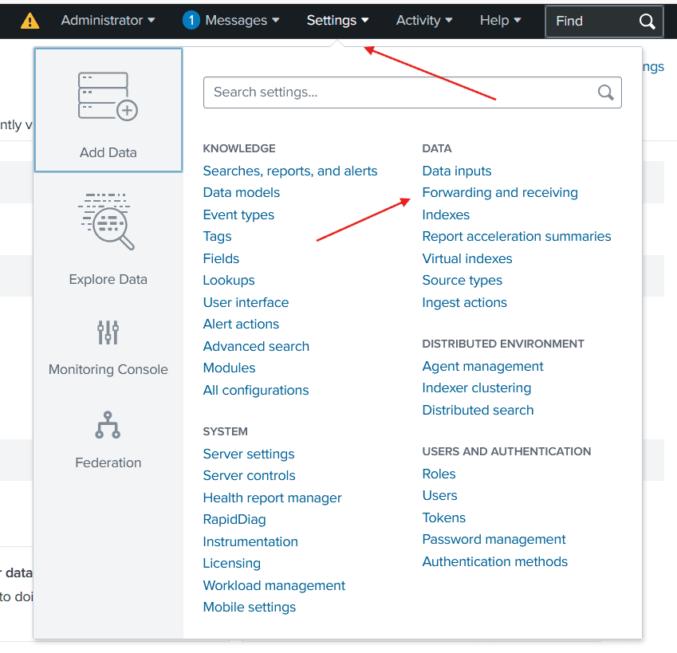{: width="400" }

- En la sección **Receive data**, haz clic en **Configure receiving**.

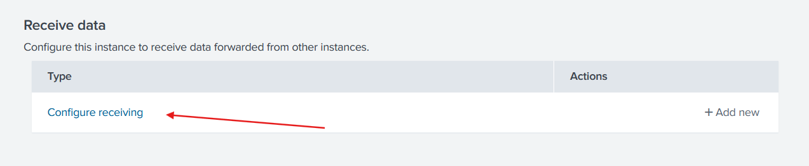

- Haz clic en **New Receiving Port**, escribe 9997 y pulsa Save.

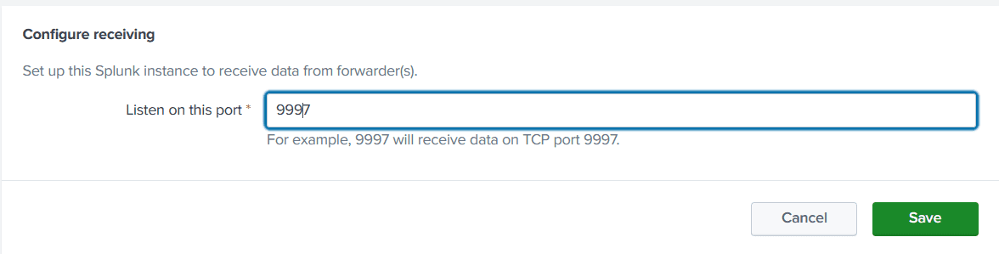

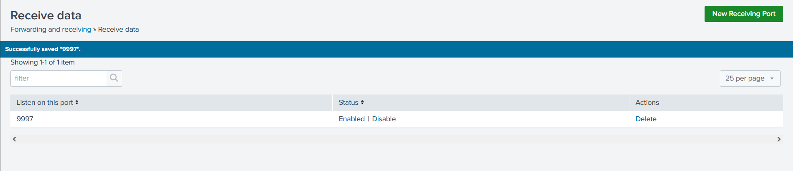

### 5. Verificando la Conexión Inicial

En la barra de búsqueda (Search & Reporting), ejecuta la siguiente consulta:

```bash
index=main host="DC01"
```

Podemos ver los eventos, significa que esta funcionando.

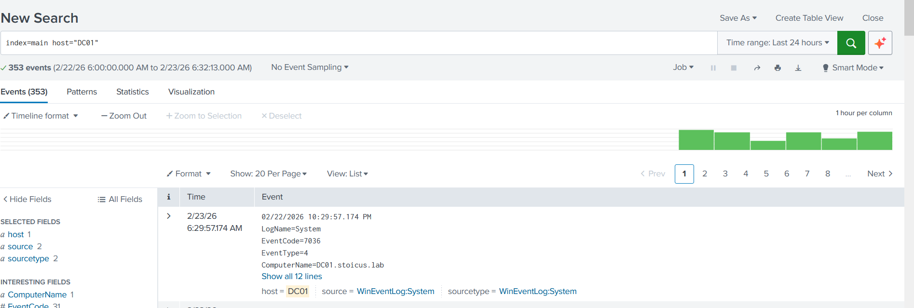

### 6. Instalación del `splunk add on for microsoft windows`

#### 1. Descarga de add on

Aprovechamos que tenemos la cuenta creada y descargamos la extensión.
- **Url Oficial:** [splunk add on](https://splunkbase.splunk.com/app/742)

#### 2. Instalación de add on

Ejecuta el comando desde la carpeta donde descargaste el archivo en Ubuntu:

```bash
sudo ./splunk install app /home/analyst/splunk-add-on-for-microsoft-windows_912.tgz
```

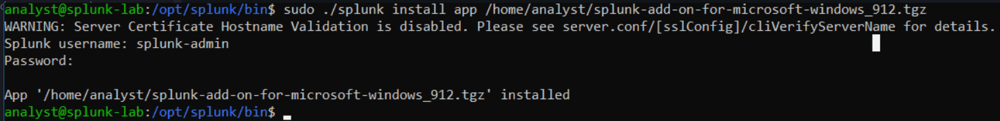

### 7. Ajuste de Telemetría: Archivo props.conf
Configuraremos la zona horaria y forzaremos la extracción de datos en formato XML. El formato XML es mucho más robusto para auditorías de Directorio Activo.

#### 1. Crear el archivo `props.conf`  (Ubuntu server)

```bash
# Crear carpeta (si no existe)
sudo mkdir -p /opt/splunk/etc/apps/Splunk_TA_windows/local
# Modificar archivo
sudo nano /opt/splunk/etc/apps/Splunk_TA_windows/local/props.conf
```

#### 2. Configuración de props.conf y Zona Horaria
Para que la línea de tiempo de los logs sea exacta, la zona horaria debe ser idéntica en Windows, en el archivo props.conf y en la interfaz de Splunk Web.

- **En Splunk Web:** Es fundamental ajustar tu perfil de usuario (Preferences > General > Time zone) para que la visualización de las búsquedas coincida con los datos reales.
- **En Windows:** Si es incorrecta, corrígela (ej. `Set-TimeZone -Name "Nombre_Zona"`).
- **En props.conf:** Añade lo siguiente para asegurar la ingesta correcta:
- 
```powershell
# Ajusta a tu zona horaria (Ejemplo: Europe/Madrid o America/Mexico_City)
TZ = Europe/Madrid
# Obligatorio para extraer los campos de Kerberos (como Ticket_Encryption_Type)
KV_MODE = xml
```

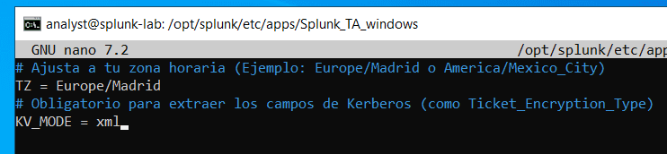

> **¿Por qué es clave?** Si estos tres puntos no coinciden, los eventos aparecerán desplazados en el tiempo, rompiendo la correlación necesaria para detectar ataques de Kerberos.
{: .prompt-info }

#### 3. Permisos y Reinicio

```bash
sudo chown -R splunk:splunk /opt/splunk/etc/apps/Splunk_TA_windows/local
sudo /opt/splunk/bin/splunk restart --run-as-root
```

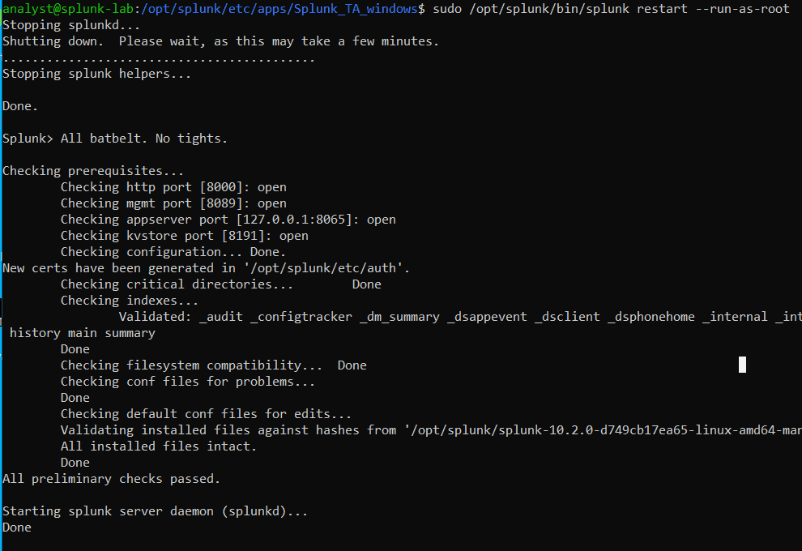{: width="500" }

### 8. Recolección Histórica: Modificando el `inputs.conf`
Por defecto, el Universal Forwarder a veces solo envía eventos nuevos. En este laboratorio, queremos todo el historial disponible en el Event Viewer.

#### 1. Modificación en Windows Server (DC01)
Abre una terminal como Administrador y edita el archivo de configuración del agente:

```powershell
notepad "C:\Program Files\SplunkUniversalForwarder\etc\system\local\inputs.conf"
```

**Contenido del archivo:**

```powershell
[WinEventLog://Microsoft-Windows-Sysmon/Operational]
disabled = 0
renderXml = 1
index = main
start_from = oldest
current_only = 0

[WinEventLog://Security]
disabled = 0
renderXml = 1
index = main
start_from = oldest
current_only = 0
```

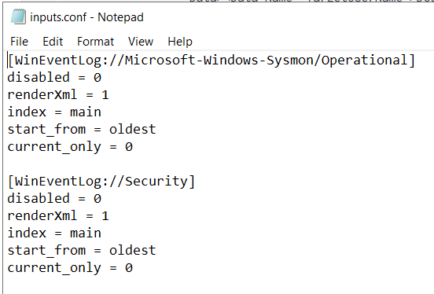{: width="500" }

#### 2. Forzar Re-indexación

Si necesitas que Splunk vuelva a leer los logs desde cero, borra el "puntero" (checkpoint) de lectura y reinicia el servicio:

```powershell
# Borramos el registro de posición de lectura
del "C:\Program Files\SplunkUniversalForwarder\var\lib\splunk\modinputs\WinEventLog"

# Reiniciamos el agente
Restart-Service splunkforwarder
```

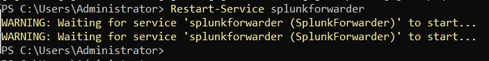

### 9. Control de Calidad: Comprobación Final
Para asegurar que no hemos perdido datos en el camino, comparamos el Event Viewer de Windows con los resultados en Splunk.

**En Windows (Event Viewer):** 89,426 eventos.

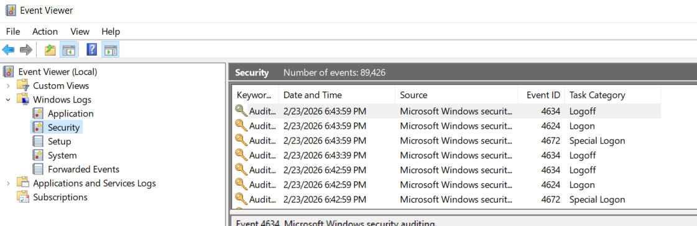


**En Splunk:** 89,985 eventos.

```bash
index=main host="DC01"  source="XmlWinEventLog:Security"
```

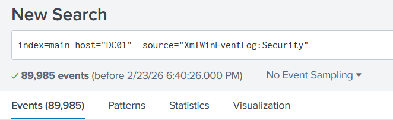

> Nota sobre discrepancias: Es normal ver una ligera diferencia. Splunk puede estar recolectando eventos de sistema que se generan en el microsegundo entre que miras una pantalla y la otra, o eventos que Windows ya eliminó de sus archivos locales pero que el Forwarder alcanzó a capturar.
{: .prompt-info }

### 10. Recomendación: Endurecimiento de la comunicación (SSL/TLS)

> **Nota de Seguridad:** Cifrado de Datos en Tránsito
Aunque en este laboratorio hemos utilizado la configuración por defecto de Splunk para agilizar el despliegue, en un entorno de producción es imperativo reemplazar los certificados SSL/TLS autofirmados por certificados emitidos por una Entidad Certificadora (CA) de confianza.
{: .prompt-danger }


> **¿Por qué es necesario este paso en entornos reales?**
  - **Prevención de ataques MitM (Man-in-the-Middle):** Evita que un atacante intercepte o modifique los logs antes de que lleguen al Indexer.
  - **Autenticidad:** Asegura que solo los servidores autorizados puedan enviar telemetría a nuestro SIEM.
  - **Cumplimiento:** Estándares como PCI-DSS, ISO 27001 o GDPR exigen que los datos sensibles (y los logs lo son) viajen cifrados con algoritmos y certificados validados.
{: .prompt-info }


## Fase 3: Análisis Forense (Investigación Retrospectiva)

En ciberseguridad, no siempre podemos detener el ataque en tiempo real, pero el sistema siempre deja rastro. En esta fase, realizaremos una investigación sobre los logs recolectados para identificar dos de las técnicas más comunes de abuso de Kerberos: AS-REP Roasting y Kerberoasting.

### 1. Detectando AS-REP Roasting (Abuso de Pre-autenticación)

El AS-REP Roasting ocurre cuando un atacante solicita un ticket de autenticación para un usuario que tiene desactivada la "Pre-autenticación de Kerberos". El servidor responde con un ticket cifrado que el atacante puede intentar crackear offline.

Para detectarlo, monitoreamos el **Evento 4768** (A Kerberos authentication ticket (TGT) was requested).

**Query de búsqueda en Splunk (SPL):**

```bash
index=main EventCode=4768 PreAuthType=0 TicketEncryptionType=0x17
| table _time, user, src_ip, TicketEncryptionType
```

> **¿Por qué estos filtros?**
- `PreAuthType=0`: Es la señal de alarma. Indica que no se requirió pre-autenticación.
- `TicketEncryptionType=0x17`: Indica el uso de cifrado RC4. Es un cifrado débil y obsoleto, preferido por los atacantes porque es mucho más rápido de crackear por fuerza bruta que AES.
{: .prompt-info }


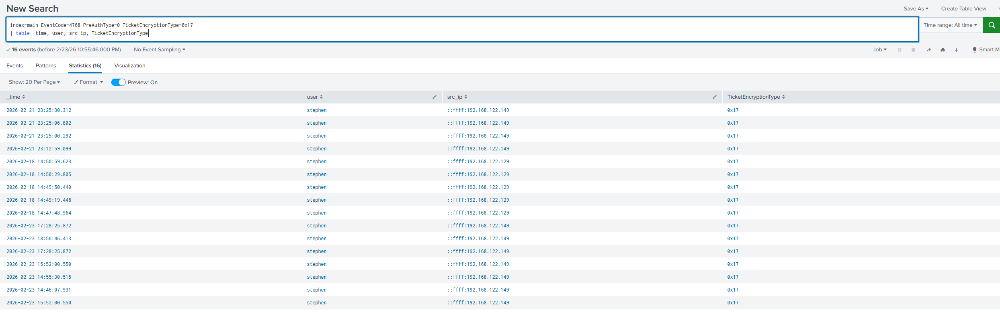

En la imagen podemos observar múltiples detecciones de AS-REP Roasting distribuidas en el tiempo. Estas marcas temporales confirman que no se trata de un evento aislado, sino de un intento sistemático por comprometer los hashes de las cuentas vulnerables.

### 2. Detectando Kerberoasting (TGS Request)

En el **Kerberoasting**, el atacante ya tiene acceso al dominio y solicita tickets de servicio (TGS) para cuentas de servicio (SPN). Al igual que en el caso anterior, busca tickets cifrados con algoritmos débiles para obtener contraseñas de cuentas con privilegios.

Para detectarlo, monitoreamos el **Evento 4769** (A Kerberos service ticket was requested).

**Query de búsqueda en Splunk (SPL):**

```bash
index=main EventCode=4769 TicketEncryptionType=0x17 user!=*$
| table _time, user, src_ip, ServiceName, TicketEncryptionType
```

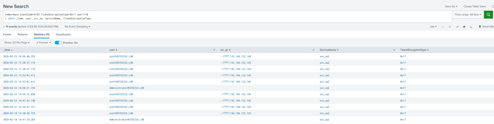

En esta captura, observamos que las peticiones se centran específicamente en el servicio `svc_sql`. Este comportamiento es un indicador crítico: un usuario común como `scott` no debería solicitar tickets de cifrado débil (RC4) para una cuenta de servicio de base de datos de forma inusual.

**Puntos clave de la investigación:**
  - `user!=*$`: En un dominio, las cuentas de máquina (que terminan en $) solicitan tickets constantemente de forma automática y legítima. Al usar `user!=*`, aislamos el comportamiento humano/inusual, permitiéndonos ver si un usuario real está pidiendo tickets para servicios que no le corresponden.

  - `ServiceName`: Si un usuario administrativo solicita un ticket para un servicio de base de datos que nunca usa, es una anomalía clara.

## Fase 4: Monitoreo y SOC (Detección en Tiempo Real)

De nada sirve tener los logs si tenemos que buscarlos manualmente cada hora. En esta fase, transformaremos nuestra investigación retrospectiva en un sistema de **monitoreo proactivo** mediante alertas automáticas y un Dashboard visual.

### 1. Creación de Alertas (Alerting)

Convertiremos nuestras búsquedas en alertas en tiempo real. Esto permite que el SIEM nos notifique en el segundo exacto en que ocurre el ataque.

- Realiza la búsqueda en Splunk.
* Haz clic en `Save As` > `Alert`.
* **Condición:** Trigger si el número de resultados es mayor a 0.

#### Alerta 1: AS-REP Roasting
- Query:
```bash
index=main EventCode=4768 PreAuthType=0 TicketEncryptionType=0x17
| table _time, user, src_ip, TicketEncryptionType
```

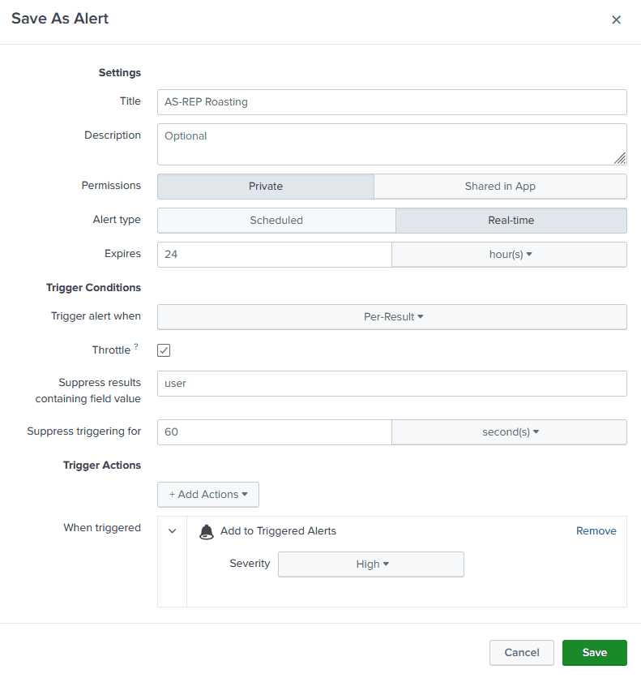{: width="400" }

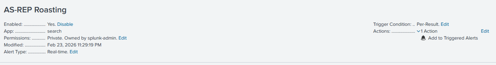

#### Alerta 2: Kerberoasting
- Query:
```bash
index=main EventCode=4769 TicketEncryptionType=0x17 user!=*$
| table _time, user, src_ip, ServiceName, TicketEncryptionType
```

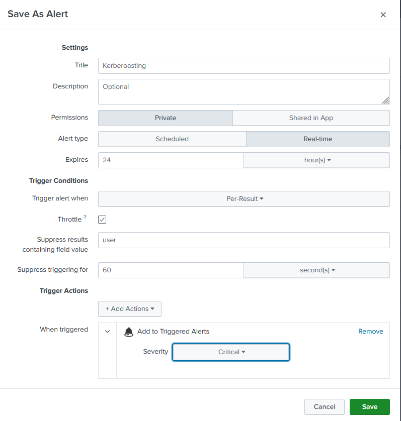{: width="400" }

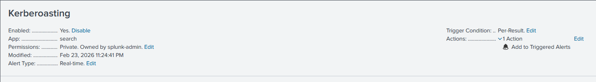

### 2. Dashboard Visual: El Centro de Mando
Un Dashboard nos permite visualizar el estado de salud del dominio de un solo vistazo.

#### 1. Crear  dashboard
- En la barra superior de Splunk, haz clic en **Dashboards**.

- Haz clic en el botón verde **Create New Dashboard**.

- Rellena los metadatos (Title, Description)

- Selecciona **Classic Dashboards** y haz clic en **Create**.

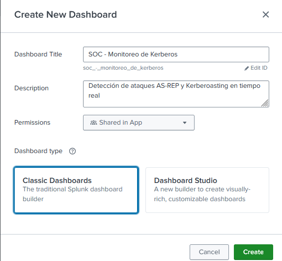{: width="400" }

> Tip: Activa el Dark theme en las opciones del dashboard y recarga la página. Hace que las alertas rojas resalten mucho más.
{: .prompt-tip }

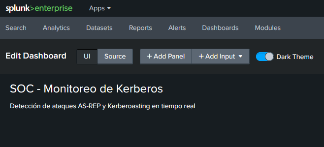

#### 2. Panel "Single Value": Contador de Alertas Críticas
Este panel actúa como un interruptor de pánico. Un número mayor a cero indica que hay un ataque activo en curso.
  
- Haz clic en **Add Panel** y selecciona **Single Value**
- Query: 

```bash
index=main (EventCode=4768 OR EventCode=4769) TicketEncryptionType=0x17 user!=*$
| stats count
```

- Configura el Time Range en "**Last 60 minutes**" para mantener el foco en la actividad reciente.
- Click en **Add to Dashboard**

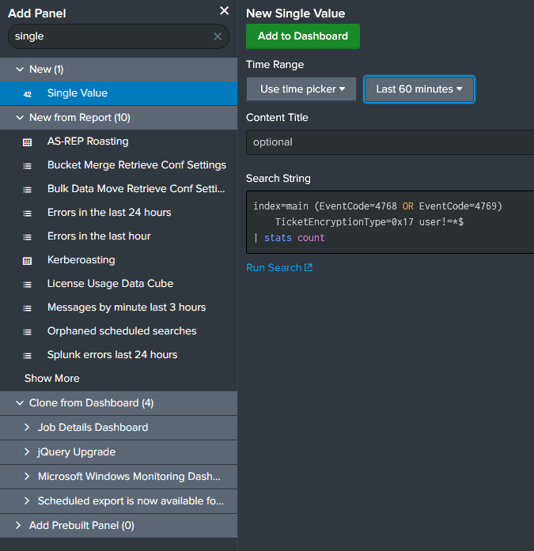{: width="500" }


**Formato de Alerta (Coloring):** Haz clic en el icono del pincel (**Format**), ve a **Coloring** y selecciona **Ranges**.
  - Define que si el valor es > 0, el panel se torne Rojo.

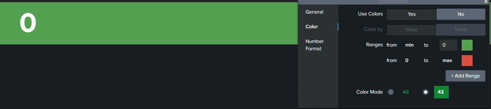{: width="600" }


#### 3. Panel "Timechart": Detección de Automatización
Los atacantes rara vez hacen Kerberoasting manualmente; usan scripts (Rubeus, Impacket) que generan ráfagas de peticiones en milisegundos. El Timechart revela estos picos de volumen.


- Haz clic en **Add Panel** y selecciona **Area Chart**.
- Pega la query para visualizar la intensidad por usuario:

```bash
index=main (EventCode=4768 OR EventCode=4769) TicketEncryptionType=0x17 user!=*$
| timechart span=5m count by user
```


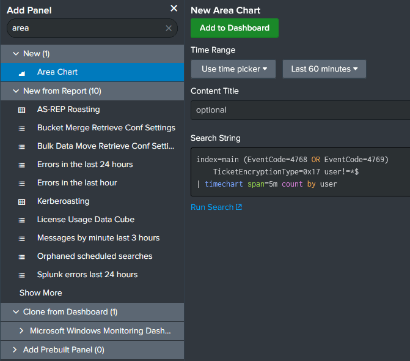{: width="500" }

- Haz clic en Add to Dashboard.
- Luego Click en **Add to Dashboard** y luego en **Save** y ya tendremos nuestro dashboard completamente creado y configurado.

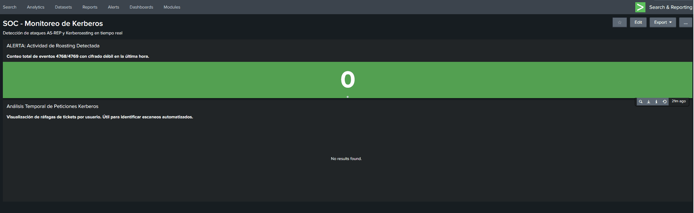{: width="600" }


### 3. Demostración en Tiempo Real: Atacante vs. Blue Team

Para validar el laboratorio, realizamos una simulación activa que enfrenta a ambos equipos en paralelo:
  - **Atacante (Kali Linux):** A la izquierda, se utiliza NetExec (nxc) para ejecutar de forma secuencial un ataque de AS-REP Roasting y uno de Kerberoasting.
  - **Defensa (Windows & Splunk):** A la derecha, el Dashboard de Splunk identifica los Indicadores de Compromiso (IoCs) y actualiza los contadores de alerta de manera inmediata al detectar el tráfico anómalo.


> **Análisis de la telemetría:** El contador muestra **3 eventos** tras ejecutar los dos comandos de `nxc`. Esto se debe a que la herramienta realiza una solicitud inicial de **TGT (Ticket Granting Ticket)** para autenticarse en el dominio antes de proceder con el Roasting. Al estar nuestra cuenta de auditoría configurada con cifrado RC4, el SIEM captura la huella completa: el inicio de sesión de la herramienta y los dos ataques dirigidos.
{: .prompt-info }


**Verificando las alertas (Triggered Alerts):**
Más allá del panel visual, Splunk habrá generado alertas formales que pueden integrarse con sistemas de notificación (correo, Slack, etc.).

- En el menu de splunk, Click en **Activity** > **Triggered Alerts**
- Aquí aparecerán las detecciones críticas con su nivel de severidad asignado.

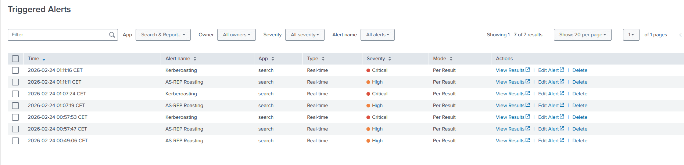

## Fase 5: Mitigación y Hardening
Detectar el ataque es solo la mitad del trabajo; la victoria real del Blue Team es evitar que el ataque sea posible. Basándonos en lo visto, estas son las acciones correctivas:

**1 Eliminar el soporte para cifrado RC4**
El uso de 0x17 (RC4) es lo que facilita el cracking.

   - **Acción:** Configurar las cuentas para que solo admitan AES-128 y AES-256. Esto se hace en las propiedades de la cuenta en Active Directory (pestaña Account).

**2 Forzar la Pre-autenticación de Kerberos**
Para evitar el AS-REP Roasting:

   - **Acción:** Asegúrate de que la casilla "**Do not require Kerberos preauthentication**" esté desmarcada para todos los usuarios. No debería haber excepciones salvo aplicaciones legacy extremadamente específicas.

**3 Gestión de Cuentas de Servicio (SPNs)**
Para mitigar el Kerberoasting:

   - **Contraseñas Robustas:** Las contraseñas de cuentas como `svc_sql` deben ser de más de 25 caracteres para que el cracking offline sea inviable.

   - **gMSA (Group Managed Service Accounts):** Siempre que sea posible, utiliza cuentas administradas por Windows que rotan su contraseña automáticamente (128 caracteres).

**4 Modelo de Tiering**
  - **Acción:** Evita que cuentas con privilegios (Domain Admins) inicien sesión en máquinas de menor seguridad donde un atacante pueda extraer sus tickets de la memoria.


## Conclusión

Construir un laboratorio de defensa no consiste simplemente en instalar software; se trata de dominar el flujo de la evidencia. A lo largo de esta guía, hemos transformado un servidor Ubuntu virgen en un SIEM de grado profesional, capaz de exponer las tácticas más sigilosas de abuso de Kerberos en un entorno de Active Directory.

**Puntos Clave del Aprendizaje**
  - **Visibilidad Total:** Aprendimos que la seguridad comienza en la base. Sin una configuración precisa de la telemetría (props.conf, inputs.conf y el uso de GPOs), los ataques de Kerberos son invisibles. La visibilidad es el primer paso para la detección.

  - **La Ventaja del Blue Team:** Al enfrentar a un atacante (Kali/NetExec) contra nuestra defensa (Splunk), validamos que los Eventos 4768 y 4769 son las "huellas dactilares" irrefutables del compromiso. Entender el porqué de filtros como PreAuthType=0 o el uso de cifrado RC4 (0x17) nos separa de los analistas que solo copian y pegan comandos.

  - **Inteligencia Visual:** Pasamos de datos crudos a un Dashboard dinámico. En un SOC real, la capacidad de ver ráfagas de ataques en tiempo real mediante un Timechart es lo que permite detener una intrusión antes de que el atacante logre crackear un solo hash.

  - **Cerrando la Puerta (Hardening):** Finalmente, entendimos que detectar no es suficiente. La implementación de tecnologías como gMSA (cuentas de servicio con contraseñas automáticas e infinitas) y el forzado de cifrado AES representan la victoria definitiva de la defensa sobre el ataque.

> **Reflexión Final:** La ciberseguridad es una carrera de armamentos constante. Mientras los atacantes refinan sus scripts, nuestra responsabilidad es refinar nuestra capacidad de observación. Este laboratorio no es un punto final, sino la base para construir una mentalidad analítica capaz de enfrentar amenazas mucho más complejas.
{: .prompt-info }


