El **Active Directory (AD)** es el blanco predilecto de los atacantes al ser el núcleo de la identidad organizacional. Dentro del ecosistema de Windows, el protocolo Kerberos presenta debilidades de diseño que permiten a un atacante obtener credenciales sin necesidad de interactuar directamente con el sistema final.

En esta serie técnica, exploraremos el Kerberoasting y el AS-REP Roasting, dos técnicas de abuso de protocolo que destacan por su efectividad y por ser sumamente silenciosas si no se cuenta con la telemetría adecuada.

- **Parte 1: El Escenario (Este post):** Despliegue de un laboratorio controlado en Windows Server 2022 y configuración de cuentas vulnerables.

- **Parte 2: La Explotación:** Abuso de los tickets TGT (AS-REP) y TGS (Kerberoasting) para el compromiso inicial y la escalada de privilegios a Domain Admin.

- **Parte 3: La Defensa:** Análisis de eventos de Sysmon y Logs de seguridad para identificar patrones de ataque.

> **Objetivo:** Al finalizar esta serie, no solo sabrás cómo realizar un ataque de Kerberoasting, sino que entenderás los rastros que deja en el sistema y cómo endurecer la seguridad de tu infraestructura.

**Objetivos del Laboratorio**

El propósito de esta guía es proporcionar un entorno paso a paso donde aprenderás a:

- Desplegar un Domain Controller desde cero en Windows Server 2022.

- Configurar vulnerabilidades de Identidad: Crearemos escenarios específicos para **AS-REP Roasting** (cuentas sin pre-autenticación) y **Kerberoasting** (cuentas con SPN).

- Implementar Sysmon para obtener visibilidad profunda del sistema.

> **Nota:** Este laboratorio está diseñado con fines educativos. Asegúrate de realizar estas pruebas siempre en entornos aislados y controlados.

## Fase 1: Despliegue del Escenario (Laboratorio)

En esta etapa inicial, prepararemos el entorno base instalando Windows Server 2022. Es fundamental configurar correctamente la red y la identidad del equipo antes de promoverlo a Controlador de Dominio.

### 1. Descargando iso - Windows Server 2022
Descargaremos la imagen ISO oficial de Windows Server 2022 desde el centro de evaluación de Microsoft.
- [Windows Server 2022](https://www.microsoft.com/es-es/evalcenter/download-windows-server-2022)

- **Selección**: Escogemos la edición de 64 bits.
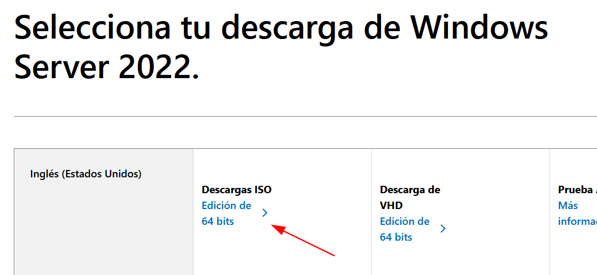{: width="400" }


### 2. Configuración de la Máquina Virtual (VMware)

Al crear la VM, omitiremos los pasos genéricos del asistente y nos centraremos en la asignación de recursos y el aislamiento de red, que son las piezas críticas para nuestro laboratorio.

1. Click Archivo > "Nueva máquina virtual"
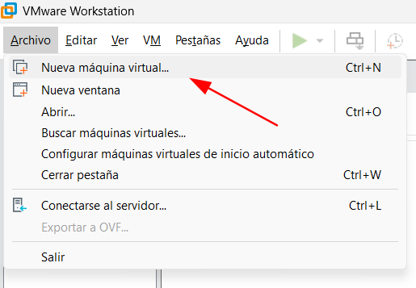{: width="400" }

2. Seleccionamos nuestra ISO de Windows Server 2022 y dejamos las configuraciones básicas por defecto (nombre de la máquina, disco, etc.)

3. **Hardware y Red (Importante):** En la personalización del hardware, ajustamos los siguientes parámetros:

   - **Memoria RAM:** 4 GB (lo mínimo recomendado para que el Domain Controller y los servicios de telemetría funcionen con fluidez).

   - **Adaptador de Red:** NAT. Esto aísla nuestro entorno de pruebas de nuestra red doméstica, permitiendo al mismo tiempo que la máquina atacante (Kali) y el servidor se comuniquen entre sí y tengan salida a Internet para descargar herramientas.
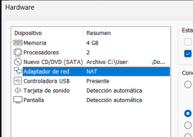


#### Instalando windows

Arrancamos la máquina virtual y comenzamos la instalación. Omitiendo los pasos más genéricos del asistente (como la selección de idioma o la aceptación de licencias), es crítico detenernos a elegir la versión correcta para este laboratorio:
  
**Edición a seleccionar:** Windows Server 2022 Datacenter Evaluation (Desktop Experience). 

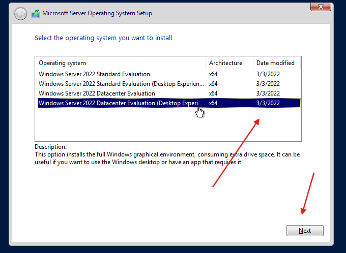{: width="600" }

> **Nota Técnica:** Es vital asegurarnos de que incluya **(Desktop Experience)**. Si elegimos la primera opción por error, instalaremos la versión Server Core (sin interfaz gráfica). Aunque en entornos reales de producción es más segura, para este laboratorio necesitamos la GUI (interfaz gráfica) para gestionar cómodamente el Active Directory y visualizar la telemetría en el Event Viewer. 

#### Configuración de la Cuenta de Administrador

Una vez finalizada la copia de archivos y el primer reinicio, el sistema nos solicitará establecer la contraseña para la cuenta de Administrator.
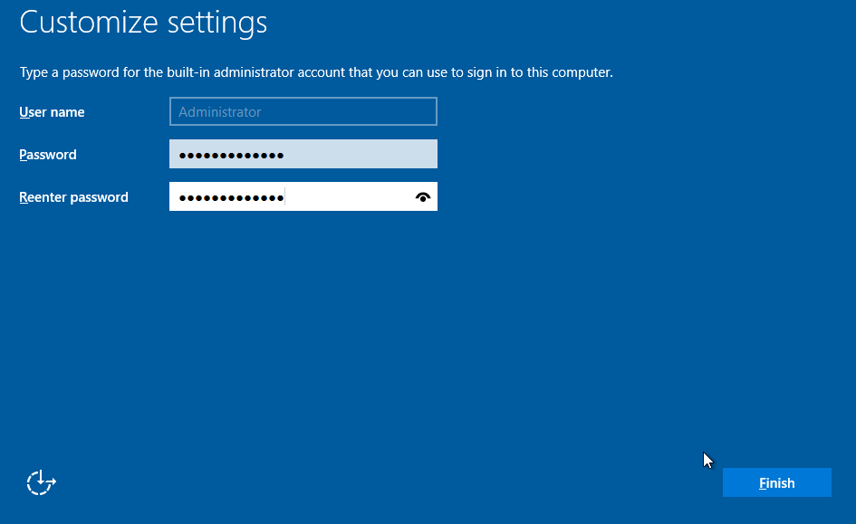{: width="600" }

  

### 3. Inicio de Sesión Inicial

Con el sistema operativo instalado, procedemos a nuestro primer inicio de sesión.
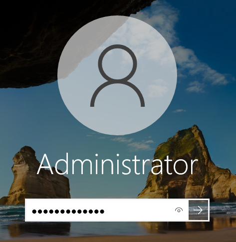{: width="300" }

**Tip para VMware:** Para enviar el comando `Ctrl + Alt + supr` a la máquina virtual sin bloquear tu PC anfitrión, utiliza la combinación `Ctrl + Alt + Insert`.

### 4. Optimización con VMware Tools

Para que el laboratorio sea funcional, debemos instalar las VMware Tools. Esto habilitará los drivers de video (mejor resolución), el portapapeles compartido y la sincronización de archivos entre tu máquina real y la virtual.

1. En el menú superior de VMware, ve a VM > Install VMware Tools.

2. Esto montará una unidad de DVD virtual en el servidor. Abre el explorador de archivos y ejecuta el archivo `setup64.exe`.

3. Sigue el asistente (la instalación "Típica" es suficiente) y, al finalizar, reinicia el servidor.

>**¿Por qué es importante?** Sin estas herramientas, no podrás copiar comandos largos de PowerShell desde este post hacia tu laboratorio.

### 5. Configuración de la Identidad (Hostname)

Por defecto, Windows asigna un nombre aleatorio (como WIN-AS829...). En un entorno profesional, seguiremos una convención de nombres clara; en este caso, DC01 (Domain Controller 01).
  
#### Verificación del nombre actual

Para abrir la consola de administración, utilizamos el atajo Win + R, escribimos powershell y pulsamos Enter.
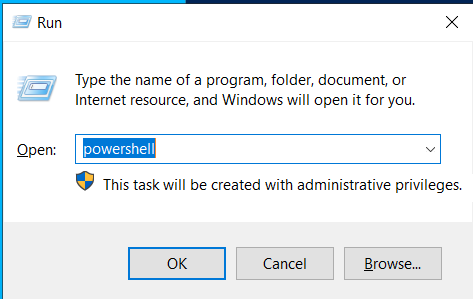{: width="300" }

En la consola, ejecutamos el siguiente comando para ver el nombre asignado actualmente:

```powershell
# Verificar el nombre actual del host
hostname
```
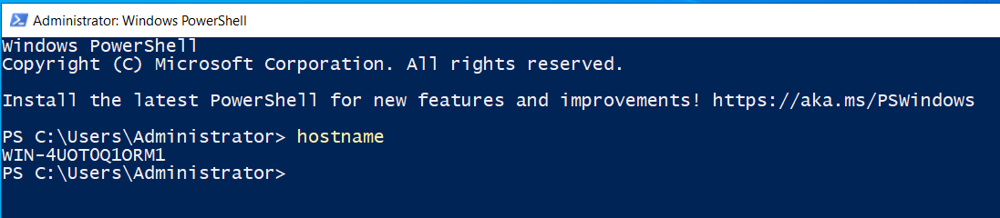

  

#### Cambio de nombre y reinicio

Para aplicar el nuevo nombre, utilizaremos el cmdlet `Rename-Computer`. El parámetro `-Restart` es fundamental, ya que los cambios de nombre en Windows no surten efecto hasta que el sistema se reinicia.
```powershell
# Cambiamos el nombre a DC01 e iniciamos el reinicio automático
Rename-Computer -NewName "DC01" -Restart
```
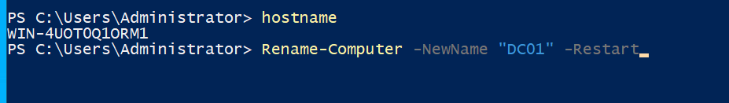

>**Aviso:** El sistema se cerrará automáticamente para procesar el cambio. Guarda cualquier trabajo pendiente antes de ejecutar el comando.

#### Verificación final

Tras el reinicio, abrimos una nueva consola para confirmar que el cambio se ha procesado correctamente.
```powershell
hostname
```
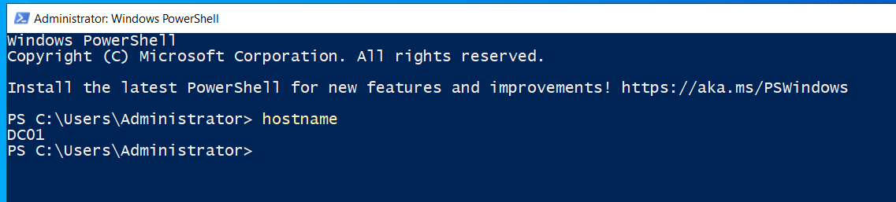

### 6. Configuración de Red Estática (PowerShell)

Para que nuestro Domain Controller sea confiable, es obligatorio que su dirección IP sea estática. Esto asegura que los clientes del dominio siempre puedan localizar los servicios de identidad y DNS.

#### Verificación de los parámetros actuales

Primero, identificamos la configuración de red asignada por el servidor DHCP de VMware para usarla como referencia (IP, Máscara y Puerta de enlace).
```powershell
# Consultar la configuración de red actual
ipconfig
```

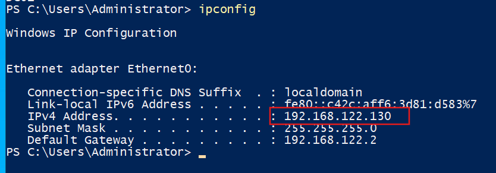

#### Cambiando a ip estática desde powershell

Utilizaremos un script de PowerShell para automatizar el cambio. Es vital que el DNS apunte a 127.0.0.1, ya que este servidor será su propio servidor DNS una vez instalado Active Directory.

```powershell
# 1. Definimos las variables de red
$IP = "192.168.122.10"       # La IP estática que desees
$Mask = "24"               # Equivale a 255.255.255.0
$Gateway = "192.168.122.2"   # Gateway de VMware NAT
$DNS = "127.0.0.1"         # Apuntamos al localhost para el futuro Active Directory 

# 2. Identificamos la interfaz de red activa (Ethernet)
$Interface = Get-NetAdapter | Where-Object {$_.Status -eq "Up"} | Select-Object -First 1

# 3. Aplicamos la configuración de IP y Gateway

# Nota: Si ya tenías una IP estática, esto podría dar error, usa 'Set-NetIPAddress' en su lugar si es el caso.
New-NetIPAddress -InterfaceIndex $Interface.ifIndex -IPAddress $IP -PrefixLength $Mask -DefaultGateway $Gateway

# 4. Configuramos el DNS
Set-DnsClientServerAddress -InterfaceIndex $Interface.ifIndex -ServerAddresses $DNS

Write-Host "Configuración de red estática completada con éxito." -ForegroundColor Green

```
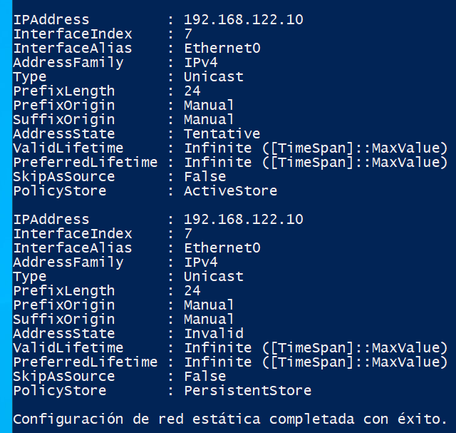{: width="400" }

  
#### Resolución de Conflictos: Error "IP already exists"

Si Windows lanza un error indicando que la IP ya está configurada, es necesario limpiar la configuración dinámica previa antes de aplicar la estática.

```powershell
# Limpieza forzada de la IP actual para evitar conflictos
Get-NetIPAddress -InterfaceIndex (Get-NetAdapter | Where-Object {$_.Status -eq "Up"}).ifIndex | Remove-NetIPAddress -Confirm:$false
```

## Fase 2: La Vulnerabilidad (El Objetivo)

En esta etapa, transformaremos nuestro servidor en un Controlador de Dominio (DC) y configuraremos intencionalmente dos de las debilidades más comunes y críticas en entornos empresariales: **Kerberoasting** y **AS-REP Roasting**.

### 1. Instalación y configuración del Active Directory (AD DS)

El primer paso es establecer los Servicios de Dominio (AD DS) para gestionar la identidad y seguridad de la red.

#### Instalar el Rol de AD DS

Ejecutamos la instalación de los binarios desde PowerShell con privilegios de administrador:
```powershell
# Instalación del rol y herramientas de gestión
Install-WindowsFeature -Name AD-Domain-Services -IncludeManagementTools
```
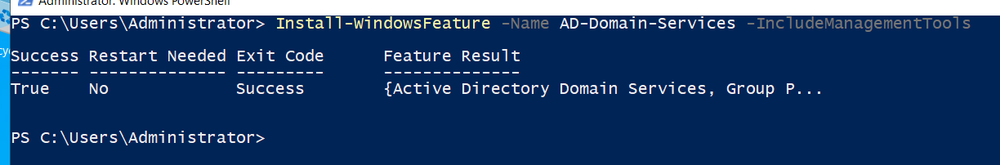

#### Promover el Servidor a Controlador de Dominio (DC)

Una vez instalados los binarios, aparecerá una notificación en el Server Manager. Hacemos clic en el icono de la bandera y seleccionamos **"Promote this server to a domain controller"**.

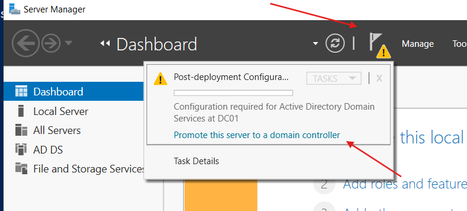

#### Configuración del Bosque y Dominio

En el asistente de configuración, seleccionamos **"Add a new forest"**. En este caso, definiremos nuestro root domain como **stoicus.lab** (o el nombre que prefieras).

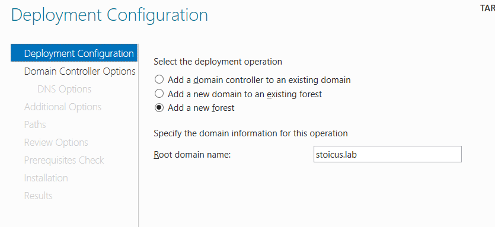

#### Contraseña de Recuperación (DSRM)

Es vital especificar una contraseña segura para el **Directory Services Restore Mode (DSRM)**. Esta será necesaria en caso de que tengamos que reparar la base de datos de AD en el futuro.

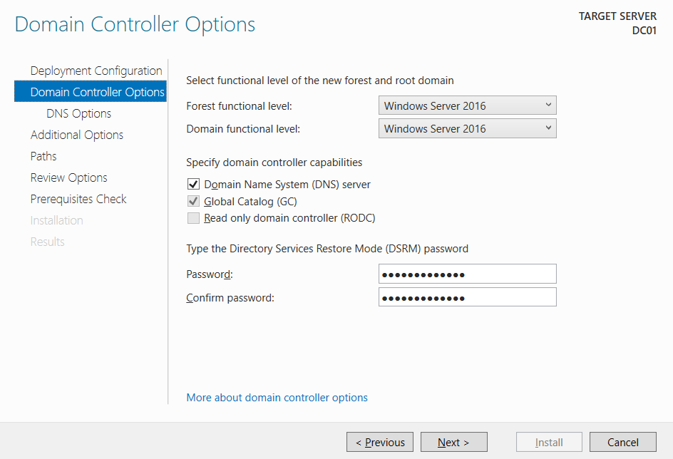

#### Verificación de NetBIOS

El sistema asignará automáticamente el nombre NetBIOS basado en el dominio anterior. En este laboratorio utilizaremos STOICUS.
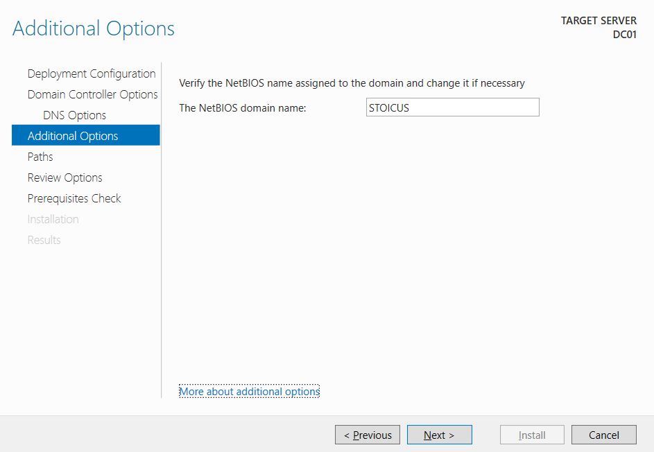

#### Comprobación de Requisitos y Finalización

Antes de proceder, el sistema realizará un Prerequisites Check. Una vez que todos los checks pasen correctamente, hacemos clic en Install. El servidor se reiniciará automáticamente al finalizar.

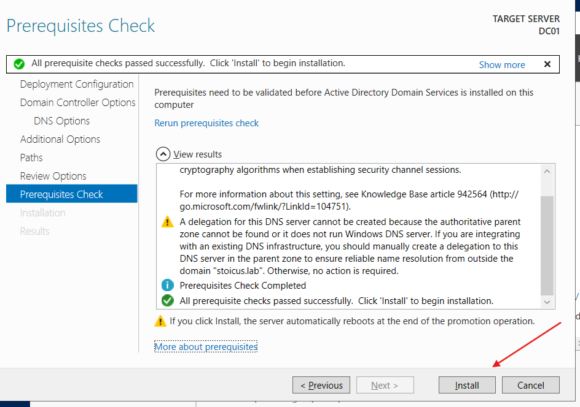

#### Iniciando sesión AD

Tras el reinicio, la pantalla de bloqueo mostrará el dominio seguido del usuario (**STOICUS\Administrator**).

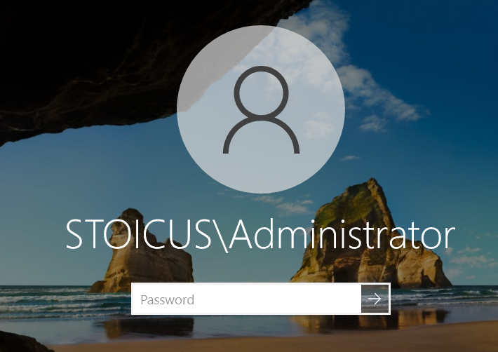{: width="400" }

### 2. Preparando el escenario: Configuración de Vectores de Ataque

El Kerberoasting es una técnica de post-explotación que permite crackear offline las contraseñas de cuentas de servicio. Para que esto sea posible, una cuenta de usuario debe tener asociado un **Service Principal Name (SPN**).

#### Gestión de Usuarios y Equipos (ADUC)

Primero, accederemos a la consola de administración de usuarios.

1. Pulsa `Win + R`, escribe `dsa.msc` y presiona Enter.
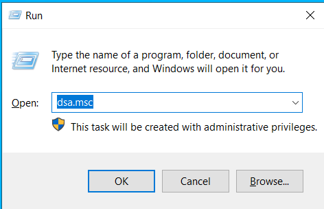{: width="400" }

2. Esto abrirá la consola de Active Directory Users and Computers (ADUC).
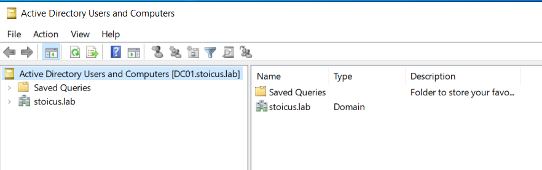

#### Creación de Usuarios
Para que nuestra simulación sea realista, no operaremos como Administrador. El objetivo es demostrar cómo un atacante puede comprometer todo el dominio partiendo de cualquier usuario estándar, abusando de configuraciones débiles en el protocolo Kerberos.

Desplegaremos tres perfiles específicos para cubrir distintos vectores:

- **Acceso Inicial:** Un usuario con contraseña débil (Password Spraying).

- **Persistencia/Pivote:** Un usuario con pre-autenticación desactivada (AS-REP Roasting).

- **Escalada de Privilegios:** Una cuenta de servicio con SPN y permisos elevados (Kerberoasting).
```powershell
# 1. Acceso Inicial: Password Spraying (Contraseña Débil)
New-ADUser -Name "Scott Marketing" -SamAccountName "scott" -Description "Vulnerable a brute force" -Enabled $true -PasswordNeverExpires $true -AccountPassword (ConvertTo-SecureString "Marketing96" -AsPlainText -Force)

# 2. Acceso Inicial: AS-REP Roasting (Sin Pre-autenticación)
New-ADUser -Name "Stephen - IT" -SamAccountName "stephen" -Description "Vulnerable a AS-REP" -Enabled $true -PasswordNeverExpires $true -AccountPassword (ConvertTo-SecureString "!Q2w#E4r%T" -AsPlainText -Force)
## Desactivando Pre-autenticación
Set-ADAccountControl -Identity "stephen" -DoesNotRequirePreAuth $true

# 3. Objetivo Final: Kerberoasting (Domain Admin)
New-ADUser -Name "SQL Service" -SamAccountName "svc_sql" -Description "Vulnerable a Kerberoasting" -Enabled $true -PasswordNeverExpires $true -AccountPassword (ConvertTo-SecureString "Password!@#" -AsPlainText -Force)

## Añadiendo svc_sql al grupo Domain Admins
Add-ADGroupMember -Identity "Domain Admins" -Members "svc_sql"

Write-Host "`n[+] Escenario desplegado correctamente en stoicus.lab" -ForegroundColor Green

# Verificación de usuarios:
Get-ADUser -Filter 'Description -like "*Vulnerable*"' | Select-Object Name, SamAccountName
```
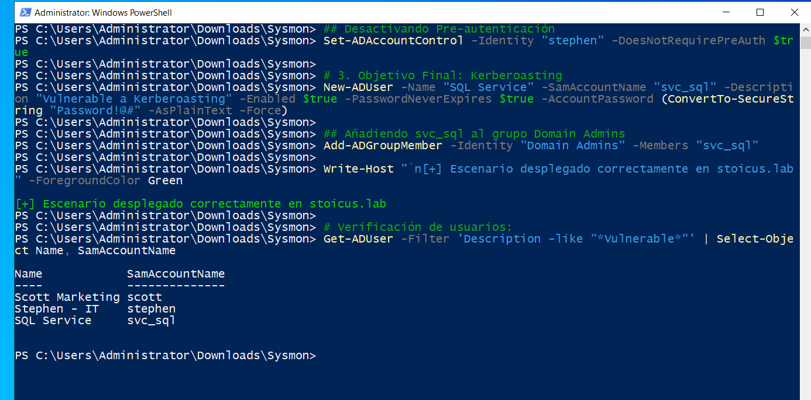

> **Próximos pasos:** En proximo post "Parte (2/3)", tomaremos el rol del atacante. Iniciaremos sesión con la cuenta de scott y utilizaremos herramientas de enumeración para identificar y explotar las vulnerabilidades de stephen y svc_sql, escalando privilegios hasta controlar el Controlador de Dominio.

### 3. Registro del Service Principal Name (SPN)

Este es el paso técnico más importante. Sin un SPN, el usuario es una cuenta normal; con él, se convierte en un objetivo de Kerberoasting.

Ejecutamos el siguiente comando en la terminal para asociar un servicio de MSSQL a nuestra cuenta:
```powershell
setspn -A MSSQL/sql01.stoicus.lab stoicus\svc_sql
```

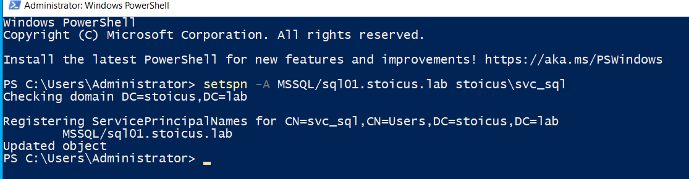

### 4. Verificación del SPN
Finalmente, comprobamos que el atributo se haya aplicado correctamente. Esto confirma que el servicio MSSQL está ahora vinculado a la cuenta svc_sql, exponiendo el hash de su contraseña a peticiones **Ticket Granting Service (TGS)**.
```powershell
# Listar SPNs de la cuenta
setspn -L stoicus\svc_sql
```
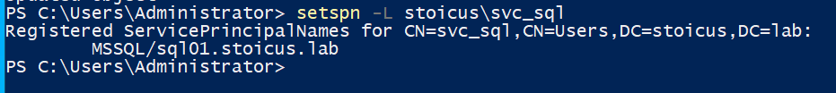


## Fase 3: Implementando Visibilidad con Sysmon

Para detectar ataques avanzados de Active Directory, los logs nativos de Windows suelen ser insuficientes. **Sysmon (System Monitor)** nos proporciona un nivel de detalle profundo sobre procesos, conexiones de red y cambios en el sistema.

### 1. Descarga de Herramientas

Necesitamos el binario de Sysmon y una configuración optimizada para evitar el "ruido" excesivo en los logs.

-   Sysmon: Descargar desde el sitio oficial (Sysinternals)
   - [Sysmon - Sysinternals](https://download.sysinternals.com/files/Sysmon.zip)


-  Configuración de SwiftOnSecurity: Utilizaremos una de las configuraciones más estandarizadas de la industria.
   -  [sysmonconfig-export.xml - github](https://github.com/SwiftOnSecurity/sysmon-config/blob/master/sysmonconfig-export.xml)

> **¿Por qué SwiftOnSecurity?** Instalar Sysmon sin una configuración adecuada generará miles de logs por segundo, lo que dificulta la búsqueda de amenazas reales. Esta configuración optimiza el rendimiento y la relevancia.

### 2. Instalación de sysmon:

Una vez descargados y descomprimidos los archivos, procedemos con la instalación mediante PowerShell con privilegios de Administrador.
  
1. Extrae el contenido de `Sysmon.zip`.

2. Asegúrate de que el archivo .xml de configuración esté en la misma ruta o una carpeta superior.

3. Ejecuta los siguientes comandos:

```powershell
# Accedemos al directorio de Sysmon
cd C:\Users\Administrator\Downloads\Sysmon

# Instalación con los flags necesarios:
## -i: Instala el servicio y el driver
## -accepteula: Acepta automáticamente los términos de licencia
.\Sysmon64.exe -i ..\sysmonconfig-export.xml -accepteula
```

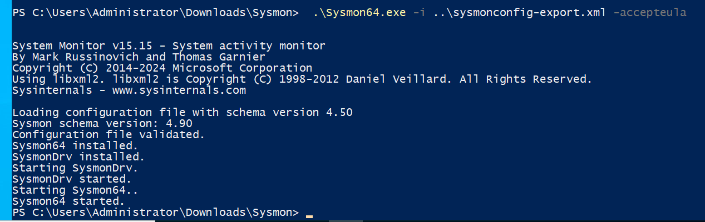

#### Verificación en el Visor de Eventos

Tras la instalación, Sysmon comenzará a registrar eventos inmediatamente. Para verificar que todo funciona correctamente:

1. Abre el Event Viewer (`eventvwr.msc`).

2. **Navega a la siguiente ruta:** `Applications and Services Logs > Microsoft > Windows > Sysmon > Operational`

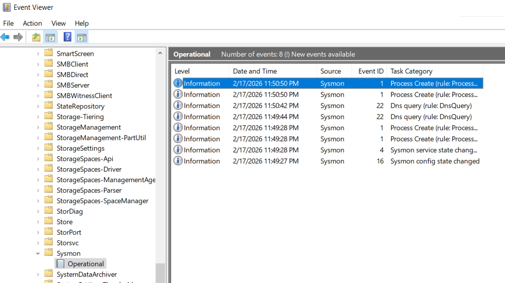

> **¿Qué buscar?** El Evento ID 1 indica la creación de un nuevo proceso. Es la señal definitiva de que Sysmon está monitorizando la actividad del sistema.
> 
### Paso Extra: Preparando la Auditoría
Para que nuestra detección en la **Fase 3** sea efectiva, no basta con Sysmon. Necesitamos que Windows registre explícitamente tanto las solicitudes de tickets iniciales (TGT) como las de servicio (TGS).

Por defecto, esta auditoría es insuficiente. Vamos a activar las subcategorías necesarias para capturar los dos eventos clave: el **Event ID 4769** (la "pistola humeante" del Kerberoasting) y el **Event ID 4768** (vital para detectar AS-REP Roasting).

Abre PowerShell como Administrador y ejecuta los siguientes comandos:

```powershell
# Captura de solicitudes de tickets de servicio (Kerberoasting - Event ID 4769)
auditpol /set /subcategory:"Kerberos Service Ticket Operations" /success:enable /failure:enable

# Captura de solicitudes de autenticación inicial (AS-REP Roasting - Event ID 4768)
auditpol /set /subcategory:"Kerberos Authentication Service" /success:enable /failure:enable
```

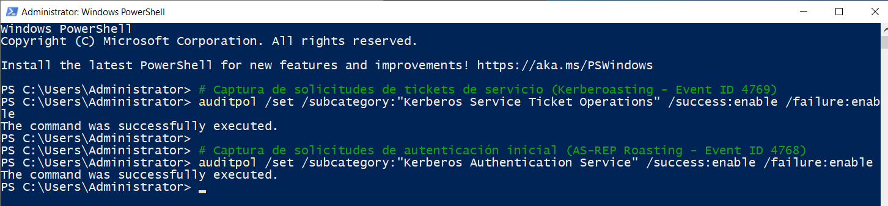

> **Nota:** Sin estos comandos, el ataque tendrá éxito, pero el sistema estará "ciego". Activar estas políticas es lo que nos permite transformar un incidente invisible en una alerta detectable en el Visor de Eventos.


## Conclusión y Próximos Pasos

Con estos pasos, el entorno base del laboratorio queda establecido. Hemos pasado de una instalación limpia de Windows Server 2022 a un sistema configurado con los pilares necesarios para la auditoría: un dominio funcional, una cuenta de servicio vulnerable y la telemetría detallada que nos proporciona Sysmon.

Haciendo un breve repaso, ya tenemos:

- [x] **Controlador de Dominio (DC01):** Un entorno funcional bajo el dominio stoicus.lab.

- [x] **Vectores de Acceso Inicial:** Cuentas preparadas para Password Spraying (scott) y AS-REP Roasting (stephen).

- [x] **Escenario de Escalada:** Una cuenta de servicio (svc_sql) configurada con un SPN y privilegios elevados, lista para el Kerberoasting.

- [x] **Telemetría Avanzada:** Sysmon desplegado con una configuración de nivel profesional para capturar cada rincón del intercambio de tickets Kerberos.

Tener el escenario listo es el 50% del camino. En las siguientes entregas, pasaremos de la configuración técnica a la ejecución táctica:

- **Parte 2 | El Ataque:** En el siguiente post, adoptaremos un rol de **Red Team (ofensivo)**. Utilizaremos herramientas de explotación para solicitar tickets de servicio (**TGS**) y realizaremos cracking offline mediante ataques de fuerza bruta y diccionarios para comprometer la cuenta `svc_sql`.

- **Parte 3 | La Defensa:** Volveremos al bando del **Blue Team**. Analizaremos la telemetría recolectada por Sysmon y los eventos de Kerberos, identificaremos los patrones específicos de ambos ataques y aprenderemos a correlacionar datos para detectar estas técnicas antes de que el atacante logre el movimiento lateral.
